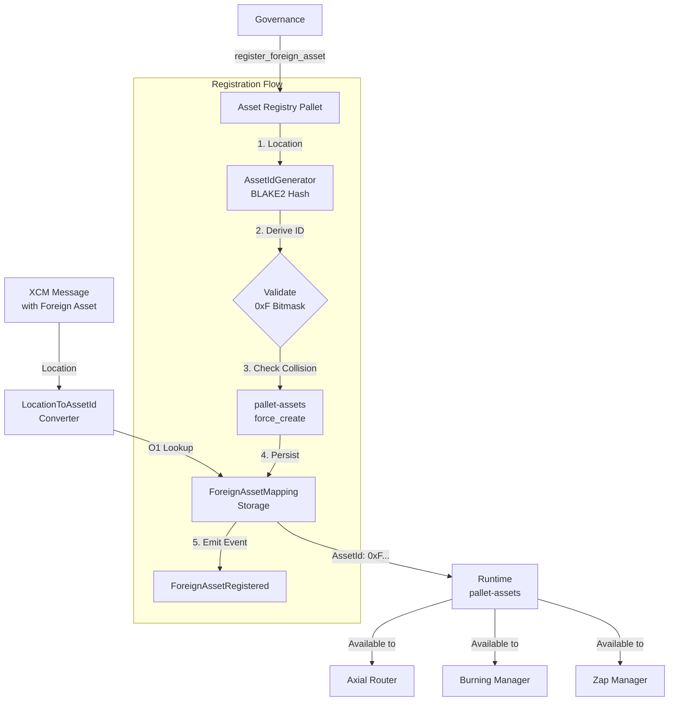

# Asset Registry: Digital Twin Architecture

> **On-Chain Account** (PalletId: `assetreg`)
> - SS58: `5EYCAe5fj8dBvWz8Un9gAkZKFqRiKaxdbjQHMLr33ZUfT78H`
> - Hex: `0x6d6f646c61737365747265670000000000000000000000000000000000000000`

## Executive Summary

The Asset Registry is the `Foreign Asset Gateway` that bridges XCM locations into the runtime's native asset system. It maintains a persistent mapping between XCM `Location` identifiers and deterministic `AssetId` values, creating a "digital twin" for every registered foreign asset.

It implements a `Hybrid Registry Pattern`: deterministic ID generation via BLAKE2 hashing at registration time, combined with persistent storage for XCM version resilience. Once registered, foreign assets become first-class citizens in `pallet-assets`, enabling seamless integration with the Router, Burning Manager, and Zap Manager.

## Architecture Overview

### Design Philosophy

1. `Deterministic ID Generation`: BLAKE2 hash of XCM Location → 32-bit index with 0xF type prefix
2. `XCM Version Resilience`: Storage persistence survives Location encoding changes (v4 → v5)
3. `Namespace Safety`: Bitmask classification prevents foreign/local/LP/native collisions
4. `Migration Support`: `migrate_location_key` allows updating Location keys without breaking balances
5. `Governance Control`: All registration requires `RegistryOrigin` (Root/Governance)

### Architectural Boundary

Asset Registry is primarily an identity/namespace layer, not a policy engine.

- `In scope`: asset identity, deterministic IDs, XCM mapping persistence, migration
- `Out of scope`: treasury policy, emission policy, bucket governance logic
- `Runtime glue`: optional callback can notify economic pallets that a token was registered (idempotent domain bootstrap)

Token lifecycle orchestration remains documented in `core-architecture.md` and executed by runtime policy wiring across economic pallets.

Current coupling status in runtime:

- registration/link extrinsics can trigger deterministic TOL domain bootstrap via runtime hook
- TMC `create_curve` then confirms/updates token-domain coupling and enables Zap processing for that token
- result: for activated tokens, Asset Registry identity is effectively connected to TMC + Zap + TOL flow without a dedicated orchestration pallet

### System Architecture



## Core Logic: The Hybrid Registry Pattern

### Registration Flow

`Phase 1 — ID Generation (Deterministic)`:

1. Encode XCM `Location` to SCALE bytes
2. Hash with BLAKE2-256 → 32-byte digest
3. Extract first 4 bytes as u32 (little-endian)
4. Apply FOREIGN type mask: `TYPE_FOREIGN | (derived_id & MASK_INDEX)`
   - Result: `0xF000_0000 | 28-bit index` → `0xFXXX_XXXX`

`Phase 2 — Validation`:

1. Verify `(asset_id & MASK_TYPE) == TYPE_FOREIGN` → ensures 0xF... namespace
2. Check `!ForeignAssetMapping::contains_key(location)` → no duplicate Location
3. Check `!pallet_assets::asset_exists(asset_id)` → no ID collision

`Phase 3 — Asset Creation (Delegation)`:

1. Call `pallet_assets::force_create(asset_id, AssetOwner, ...)` via Root origin
2. Call `pallet_assets::force_set_metadata(asset_id, symbol, ...)` for XCM metadata

`Phase 4 — Persistence`:

1. Store `ForeignAssetMapping[location] = asset_id`
2. Emit `ForeignAssetRegistered { asset_id, location, symbol }`

### Why Hybrid (Not Pure Hashing)?

`Problem with pure hashing`:

- XCM v4 → v5 migration changes Location SCALE encoding
- Same conceptual asset (e.g., `Parachain(2000)::PalletInstance(50)`) → different hash
- Breaks all existing balances and approvals

`Solution`:

- Hash only at registration time
- Store mapping in runtime storage
- XCM converter does O(1) storage lookup (not re-hashing)
- Migration: `migrate_location_key(old_loc, new_loc)` updates key, preserves AssetId

### Manual Registration (Edge Cases)

`register_foreign_asset_with_id(location, asset_id)`:

- For manual ID assignment (collision resolution, specific namespace requirements)
- Still validates 0xF... bitmask
- Use case: Governance override when hash collides with existing asset

`link_existing_asset(location, asset_id)`:

- Links pre-existing `pallet-assets` asset to XCM Location
- Use case: Retroactive registration after manual asset creation
- Skips `force_create`, only stores mapping

## AssetKind Bitmask Classification

The runtime uses a 4-bit type prefix for O(1) asset kind inspection:

| Type      | Bitmask       | Example       | Description                               |
| :-------- | :------------ | :------------ | :---------------------------------------- |
| `Native`  | `0x0000_0000` | `0x0000_0000` | Native chain token (single instance)      |
| `Local`   | `0x1XXX_XXXX` | `0x1000_0042` | Locally-issued assets (28-bit index)      |
| `LP`      | `0x4XXX_XXXX` | `0x4000_002A` | Liquidity pool tokens (28-bit index)      |
| `Foreign` | `0xFXXX_XXXX` | `0xF123_4567` | XCM-bridged foreign assets (28-bit index) |

`Classification logic`:

```rust
pub fn is_foreign(asset_id: AssetId) -> bool {
    (asset_id & MASK_TYPE) == TYPE_FOREIGN
}
```

`Namespace capacity`:

- Each type: 2^28 = 268,435,456 unique assets
- Foreign assets guaranteed non-overlapping with Local/LP

## Core Components

### 1. ForeignAssetMapping Storage

```rust
#[pallet::storage]
pub type ForeignAssetMapping<T: Config> = StorageMap<
    _,
    Blake2_128Concat,
    Location,  // XCM MultiLocation
    AssetId,   // u32 with 0xF type prefix
    OptionQuery,
>;
```

`Access patterns`:

- `location_to_asset(location)` → O(1) lookup during XCM execution
- Iterated during governance audits (rare)

### 2. AssetIdGenerator (xcm_config.rs)

```rust
pub struct Blake2AssetIdGenerator;

impl Convert<Location, AssetId> for Blake2AssetIdGenerator {
    fn convert(location: Location) -> AssetId {
        let hash = blake2_256(&location.encode());
        let raw_id = u32::from_le_bytes([hash[0], hash[1], hash[2], hash[3]]);
        TYPE_FOREIGN | (raw_id & MASK_INDEX)
    }
}
```

`Properties`:

- Deterministic: Same Location → Same ID (at time of registration)
- Uniform distribution: BLAKE2 ensures even spread across 28-bit space
- Collision rate: ~1 in 268M (negligible for typical parachain deployments)

### 3. LocationToAssetId Converter

XCM AssetTransactor uses this converter to resolve incoming assets:

```rust
impl Convert<Location, AssetId> for LocationToAssetIdConverter {
    fn convert(location: Location) -> AssetId {
        // O(1) storage lookup (NOT re-hashing)
        ForeignAssetMapping::<Runtime>::get(location)
            .unwrap_or(AssetId::MAX)  // Reject unregistered assets
    }
}
```

`Failure mode`: Unregistered assets return invalid ID → transfer rejected.

### 4. Governance Parameters

| Parameter          | Type                         | Description                                           |
| :----------------- | :--------------------------- | :---------------------------------------------------- |
| `RegistryOrigin`   | `EnsureOrigin`               | Who can register assets (typically Root/Council)      |
| `AssetOwner`       | `AccountId`                  | Account that owns created assets (typically Treasury) |
| `AssetIdGenerator` | `Convert<Location, AssetId>` | Hashing strategy (BLAKE2 default)                     |

## Ecosystem Integration

### Connection to XCM (Primary Inflow)

When an XCM message transfers foreign assets:

1. XCM executor calls `AssetTransactor::transfer_asset(asset, location, ...)`
2. AssetTransactor converts `asset.id` (Location) → `AssetId` via storage lookup
3. If registered → standard `pallet-assets` transfer
4. If unregistered → reject transfer (asset not whitelisted)

`Implicit whitelist`: Only governance-registered assets can enter the runtime.

### Connection to Axial Router (Foreign Swaps)

Router accepts foreign assets in swap paths if:

1. Asset is registered (has valid AssetId)
2. Liquidity pool exists for the pair

Example: `swap(USDC_Foreign, Native)` where `USDC_Foreign = 0xF123_4567` (registered).

### Connection to Burning Manager (Fee Compression)

BM processes foreign assets via:

1. Check if asset is in `BurnableAssets` registry
2. If `asset.is_foreign()` → swap to Native
3. Burn Native in Phase 2

Foreign assets must be registered before BM can process them.

### Connection to Zap Manager (Foreign LP Pairs)

ZM can create liquidity pools with foreign assets:

- Example: `Native <-> USDC_Foreign` pool
- Both assets must exist in `pallet-assets`
- Foreign asset must be registered via Asset Registry first

## Events

| Event                                                       | Description                                 |
| :---------------------------------------------------------- | :------------------------------------------ |
| `ForeignAssetRegistered { asset_id, location, symbol }`     | New foreign asset registered or linked      |
| `MigrationApplied { asset_id, old_location, new_location }` | Location key migrated (XCM version upgrade) |

## Migration Pattern (XCM Version Upgrades)

`Scenario`: XCM v4 → v5 changes Location encoding.

`Without migration`:

- Old Location key in storage → no longer matches incoming XCM messages
- All foreign asset transfers fail

`With `migrate_location_key``:

```rust
// Governance proposal
migrate_location_key(
    old_location: Location::V4(ParachainLocation),
    new_location: Location::V5(ParachainLocation),
)
```

`Result`:

1. Remove `ForeignAssetMapping[old_location]`
2. Insert `ForeignAssetMapping[new_location] = asset_id`
3. AssetId unchanged → all balances, approvals, pools preserved
4. Emit `MigrationApplied` event

## Implementation Status

- `Mechanism`: Governance-triggered registration (no user extrinsics).
- `Strategy`: Hybrid (deterministic generation + persistent storage).
- `Security`: Bitmask validation + RegistryOrigin + collision checks.
- `Migration Path`: `migrate_location_key` for XCM upgrades.
- `Integration`: Full support in Router, BM, ZM via `pallet-assets`.
- `Domain Bootstrap Hook`: Runtime can auto-bootstrap token domain mapping (e.g., TOL domain create/bind) on registration.
