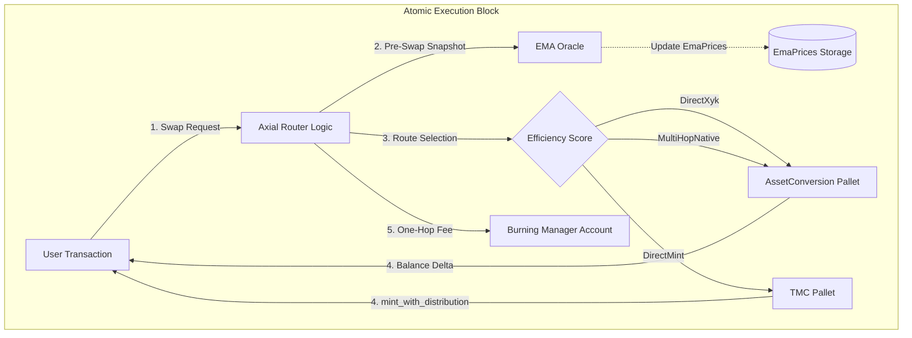

# Axial Router: Minimalist Multi-Token Routing Architecture

> **On-Chain Account** (PalletId: `axialrt0`)
>
> - SS58: `5EYCAe5fjMgntj8Tch49FZ3RXMR1XiQbrSA1z2oYgQAiXukN`
> - Hex: `0x6d6f646c617869616c7274300000000000000000000000000000000000000000`

## Executive Summary

The Axial Router is a specialized `Deterministic Economic Automaton` designed for TMC (Token Minting Curve) ecosystems. Unlike general-purpose aggregators, it operates as a strict `Decision Engine` atop the parachain's internal liquidity.

It enforces a `Protocol-First` routing logic: instead of merely finding a path, it calculates an `Efficiency Score` to arbitrate between Market Liquidity (XYK Pools) and Protocol Liquidity (TMC Curves), using the Native token as the sole routing anchor.

## Architecture Overview

### Design Philosophy

1.  `Stateless Execution` - Zero intermediate buffers; logic operates purely on input balances.
2.  `Oracle-First Security` - EMA prices are updated _before_ execution to prevent intra-block manipulation.
3.  `Trustless Verification` - Execution results are verified via physical balance deltas, not theoretical quotes.
4.  `Native-Only Anchor` - Reduces graph complexity by using Native token as the universal hub.
5.  `Anti-Self-Taxation` - Router's own account is exempt from fees to prevent recursive deductions during system operations.

### System Architecture



### Swap Execution Flow

The `swap` extrinsic delegates to `execute_swap_for()`, the shared entry point for both user and system swaps:

1. `Extrinsic Validation`: `amount_in >= MinSwapForeign`, `block <= deadline`.
2. `Core Validation`: `from != to`, `amount_in > 0`.
3. `Pre-Swap Oracle Update`: Snapshot pool reserves and update EMA prices _before_ trade.
4. `Fee Calculation`: Zero for fee-exempt system accounts (BM, ZM, Router); `Permill`-based for users.
5. `Route Selection`: `find_optimal_route()` evaluates all candidates, selects by highest `efficiency_score()`.
6. `Price Protection`: Validate quote against EMA oracle and slippage bounds.
7. `Execution`: Dispatch to XYK adapter or TMC `mint_with_distribution`. System accounts use `keep_alive=false` (can drain balances); users use `keep_alive=true`.
8. `Fee Collection`: One-hop transfer from user to Burning Manager via `FeeAdapter::route_fee()`.
9. `Event Emission`: `SwapExecuted { who, from, to, amount_in, amount_out }`.

`Public API`: `execute_swap_for(who, from, to, amount_in, min_amount_out, recipient)` — callable by other pallets (BM, ZM) for system-level swaps with automatic fee exemption and keep-alive awareness.

## Core Components

### Path Discovery & Route Selection

The router utilizes a `Lazy Discovery` algorithm via `find_optimal_route()`. It evaluates up to 3 candidate routes and selects the one with the highest efficiency score:

| Route Type    | Mechanism                      | Condition                                                                        |
| :------------ | :----------------------------- | :------------------------------------------------------------------------------- |
| `Direct XYK`  | `DirectXyk { pool_id }`        | Pool exists for `(from, to)` pair                                                |
| `Direct Mint` | `DirectMint { foreign_asset }` | `from != Native`, `to == Native`, TMC curve exists for `to`                      |
| `Multi-Hop`   | `MultiHopNative { hops }`      | `from != Native`, `to != Native`, both `from→Native` and `Native→to` pools exist |

### Efficiency Score

Each `RouteComparison` candidate is scored:

```
Score = expected_output - (price_impact × output / 1000) - total_fees
```

Price impact is calculated against EMA oracle prices for direct routes, or against a hypothetical direct quote for multi-hop routes. TMC routes have zero price impact (deterministic pricing).

### Fee Architecture

| Property        | Value                                                            |
| :-------------- | :--------------------------------------------------------------- |
| `Default Fee`   | `0.5%` (`Permill::from_parts(5_000)`)                            |
| `Math`          | `Permill::mul_floor(amount_in)` — overflow-safe                  |
| `Routing`       | One-hop: `User → Burning Manager` (no intermediate buffer)       |
| `Governance`    | Updatable via `update_router_fee` (Root origin)                  |
| `Self-Taxation` | Router, BM, and ZM accounts are fee-exempt via `is_fee_exempt()` |

The `FeeRoutingAdapter` trait provides the transfer interface:

```rust
pub trait FeeRoutingAdapter<AccountId, Balance> {
  fn route_fee(who: &AccountId, asset: AssetKind, amount: Balance) -> DispatchResult;
}
```

Runtime implementation (`FeeManagerImpl`) dispatches to `Currency::transfer` for Native or `Assets::transfer` with `Preservation::Protect` for Local/Foreign assets.

## Trait Interfaces

The pallet is fully decoupled from concrete implementations through 4 trait boundaries:

### AssetConversionApi

```rust
pub trait AssetConversionApi<AccountId, Balance> {
  fn get_pool_id(asset_a: AssetKind, asset_b: AssetKind) -> Option<(AssetKind, AssetKind)>;
  fn get_pool_reserves(pool_id: (AssetKind, AssetKind)) -> Option<(Balance, Balance)>;
  fn quote_price_exact_tokens_for_tokens(
    asset_in: AssetKind, asset_out: AssetKind, amount_in: Balance, include_fee: bool,
  ) -> Option<Balance>;
  fn swap_exact_tokens_for_tokens(
    who: AccountId, path: Vec<AssetKind>, amount_in: Balance,
    min_amount_out: Balance, recipient: AccountId, keep_alive: bool,
  ) -> Result<Balance, DispatchError>;
}
```

Runtime `AssetConversionAdapter` wraps `pallet_asset_conversion` with `Balance-Delta Verification`: it snapshots recipient balance before swap, executes, and returns `balance_after - balance_before` instead of theoretical quotes.

### TmcInterface

```rust
pub trait TmcInterface<AccountId, Balance> {
  fn has_curve(asset: AssetKind) -> bool;
  fn calculate_user_receives(token_asset: AssetKind, foreign_amount: Balance) -> Result<Balance, DispatchError>;
  fn mint_with_distribution(
    who: &AccountId, token_asset: AssetKind, foreign_asset: AssetKind, foreign_amount: Balance,
  ) -> Result<Balance, DispatchError>;
}
```

Runtime `TmcPalletAdapter` delegates directly to `pallet_token_minting_curve::Pallet::<T>`.

### PriceOracle

```rust
pub trait PriceOracle<Balance> {
  fn update_ema_price(asset_in: AssetKind, asset_out: AssetKind, price: Balance, tvl: Balance) -> Result<(), DispatchError>;
  fn get_ema_price(asset_in: AssetKind, asset_out: AssetKind) -> Option<Balance>;
  fn validate_price_deviation(asset_in: AssetKind, asset_out: AssetKind, current_price: Balance) -> Result<(), DispatchError>;
}
```

Runtime `PriceOracleImpl` uses the pallet's own `EmaPrices` storage (see EMA Oracle section below).

### FeeRoutingAdapter

```rust
pub trait FeeRoutingAdapter<AccountId, Balance> {
  fn route_fee(who: &AccountId, asset: AssetKind, amount: Balance) -> DispatchResult;
}
```

Runtime `FeeManagerImpl` performs direct `Currency::transfer` (Native) or `Assets::transfer` with `Preservation::Protect` (Local/Foreign) to the Burning Manager account.

## EMA Oracle Architecture

### Storage

The EMA oracle maintains `2 dedicated storage maps` inside the Axial Router pallet:

| Storage            | Type               | Key                      | Value                                   |
| :----------------- | :----------------- | :----------------------- | :-------------------------------------- |
| `EmaPrices<T>`     | `StorageDoubleMap` | `(AssetKind, AssetKind)` | `Balance` — current EMA price           |
| `EmaLastUpdate<T>` | `StorageDoubleMap` | `(AssetKind, AssetKind)` | `BlockNumberFor<T>` — last update block |

All maps use `Blake2_128Concat` hashing and are keyed by directional asset pairs `(asset_in, asset_out)`.

TVL is not oracle-smoothed — it is read directly from pool reserves via `get_pool_reserves()` during route selection, always reflecting the current on-chain state.

### EMA Update Logic (Runtime Adapter)

The `PriceOracleImpl` implements a time-weighted smoothing formula:

```
EMA_new = α × spot_price + (1 - α) × EMA_previous
```

Where `α = elapsed_blocks / (EmaHalfLife + elapsed_blocks)` using `Permill` arithmetic. The `elapsed_blocks` is computed from `EmaLastUpdate` storage, making the EMA converge faster when swaps are infrequent. On first observation (`EMA_previous == 0`), the spot price is accepted directly.

### Pre-Swap Oracle Invariant

Oracle updates execute `before` the swap modifies reserves, recording the "fair" pre-manipulation price:

```rust
fn update_oracle_from_reserves(from: AssetKind, to: AssetKind) -> Result<(), Error<T>> {
  if let Some(pool_id) = T::AssetConversion::get_pool_id(from, to) {
    if let Some((res_a, res_b)) = T::AssetConversion::get_pool_reserves(pool_id) {
      let (reserve_in, reserve_out) = if pool_id.0 == from {
        (res_a, res_b)
      } else {
        (res_b, res_a)
      };
      if !reserve_in.is_zero() {
        let spot_price = reserve_out
          .saturating_mul(T::Precision::get())
          .saturating_div(reserve_in);
        T::PriceOracle::update_ema_price(from, to, spot_price)?;
      }
    }
  }
  Ok(())
}
```

### Price Deviation Validation

`validate_price_deviation` computes `|current_price - ema_price| / ema_price` as `Permill` and rejects if it exceeds `MaxPriceDeviation` (default 20%). When no EMA data exists yet, validation is skipped.

### Tracked Assets

`TrackedAssets<T>` is a `BoundedVec<AssetKind, MaxTrackedAssets>` managed via governance extrinsic `add_tracked_asset`. Maximum capacity: 64 assets. Used for external oracle monitoring; the pre-swap update operates on the actual swap pair regardless of this list.

## Storage Summary

| Storage Item       | Type                       | Description                                                              |
| :----------------- | :------------------------- | :----------------------------------------------------------------------- |
| `RouterFee<T>`     | `StorageValue<Permill>`    | Current fee rate (governance-updatable, default from `DefaultRouterFee`) |
| `TrackedAssets<T>` | `StorageValue<BoundedVec>` | Governance-managed asset tracking list                                   |
| `EmaPrices<T>`     | `StorageDoubleMap`         | EMA prices per directional pair                                          |
| `EmaLastUpdate<T>` | `StorageDoubleMap`         | Last update block per pair                                               |

## Extrinsics

| Call Index | Extrinsic                                                        | Origin             | Weight      |
| :--------- | :--------------------------------------------------------------- | :----------------- | :---------- |
| `0`        | `swap(from, to, amount_in, min_amount_out, recipient, deadline)` | Signed             | Benchmarked |
| `1`        | `add_tracked_asset(asset)`                                       | AdminOrigin (Root) | Benchmarked |
| `2`        | `update_router_fee(new_fee)`                                     | AdminOrigin (Root) | Benchmarked |

## Events

| Event               | Fields                                 | Trigger                       |
| :------------------ | :------------------------------------- | :---------------------------- |
| `SwapExecuted`      | `who, from, to, amount_in, amount_out` | Successful swap               |
| `FeeCollected`      | `asset, amount, source, collector`     | Fee routed to Burning Manager |
| `TrackedAssetAdded` | `asset`                                | Governance adds tracked asset |
| `RouterFeeUpdated`  | `old_fee, new_fee`                     | Governance updates fee        |

## Errors

| Error                      | Trigger                                       |
| :------------------------- | :-------------------------------------------- |
| `NoRouteFound`             | No pool or TMC curve available for the pair   |
| `IdenticalAssets`          | `from == to`                                  |
| `ZeroAmount`               | `amount_in == 0`                              |
| `AmountTooLow`             | `amount_in < MinSwapForeign`                  |
| `SlippageExceeded`         | `amount_out < min_amount_out`                 |
| `DeadlinePassed`           | `current_block > deadline`                    |
| `FeeRoutingFailed`         | Fee transfer to Burning Manager failed        |
| `PriceDeviationExceeded`   | Spot price deviates from EMA beyond threshold |
| `MaxTrackedAssetsExceeded` | `TrackedAssets` at capacity (64)              |

## Configuration Constants

All constants are sourced from `primitives::ecosystem` — single source of truth:

| Constant            | Value                               | Source                                          |
| :------------------ | :---------------------------------- | :---------------------------------------------- |
| `PalletId`          | `*b"axialrt0"`                      | `ecosystem::pallet_ids::AXIAL_ROUTER_PALLET_ID` |
| `DefaultRouterFee`  | `Permill::from_parts(5_000)` (0.5%) | `ecosystem::params::AXIAL_ROUTER_FEE`           |
| `Precision`         | `1_000_000_000_000` (10¹²)          | `ecosystem::params::PRECISION`                  |
| `EmaHalfLife`       | `100` blocks (~10 min @ 6s/block)   | `ecosystem::params::EMA_HALF_LIFE_BLOCKS`       |
| `MaxPriceDeviation` | `Permill::from_percent(20)`         | `ecosystem::params::MAX_PRICE_DEVIATION`        |
| `MaxHops`           | `3`                                 | `ecosystem::params::MAX_HOPS`                   |
| `MaxTrackedAssets`  | `64`                                | Runtime `ConstU32`                              |
| `MinSwapForeign`    | `1_000_000_000_000` (1.0 token)     | `ecosystem::params::MIN_SWAP_FOREIGN`           |

## Genesis Configuration

```rust
pub struct GenesisConfig<T: Config> {
  pub tracked_assets: Vec<AssetKind>, // Default: [AssetKind::Native]
}
```

Initializes `TrackedAssets` storage on chain genesis and calls `inc_providers` on the pallet account (ED-free: survives zero native balance).

## Runtime Adapters

The runtime (`axial_router_config.rs`) provides 4 concrete adapter implementations:

| Adapter                  | Trait                | Strategy                                                        |
| :----------------------- | :------------------- | :-------------------------------------------------------------- |
| `AssetConversionAdapter` | `AssetConversionApi` | Wraps `pallet_asset_conversion` with Balance-Delta Verification |
| `TmcPalletAdapter<T>`    | `TmcInterface`       | Direct delegation to `pallet_token_minting_curve`               |
| `PriceOracleImpl<T>`     | `PriceOracle`        | Time-weighted EMA using `EmaPrices` + `EmaLastUpdate` storage   |
| `FeeManagerImpl<T>`      | `FeeRoutingAdapter`  | Direct transfer to Burning Manager (`Preservation::Protect`)    |

## Test Coverage

### Unit Tests (29 tests)

- `Fee Math`: `router_fee_calculation_logic`, `large_amount_fee_calculation`, `zero_amount_fee_calculation`, `updated_fee_is_used_in_calculations`.
- `Route Intelligence`: `router_intelligence_test` — verifies XYK preferred when output > TMC, TMC preferred when output > XYK.
- `Protection`: `circular_swap_protection_test`, `slippage_protection_test`, `sandwich_attack_simulation` — proves round-trip attack is unprofitable due to fees.
- `Governance`: `governance_can_update_router_fee`, `only_governance_can_update_router_fee`, `governance_can_add_tracked_assets`, `only_governance_can_add_tracked_assets`.
- `Adapter Contracts`: `fee_routing_adapter_test`, `price_oracle_test`, `tmc_interface_test`, `asset_conversion_api_test`.
- `Integration Math`: `tmctol_integration_flow`, `tmctol_parameter_validation`, `precision_constant_validation`.
- `Multi-Hop Routing` (8 tests):
  - `multi_hop_swap_dot_native_usdc` — end-to-end DOT → Native → USDC via multi-hop.
  - `multi_hop_output_matches_sequential_hops` — verifies output equals manual two-hop XYK math.
  - `multi_hop_slippage_protection` — unreachable min_amount_out triggers `SlippageExceeded`.
  - `multi_hop_not_used_when_direct_pool_exists` — direct route wins when it gives better output.
  - `multi_hop_no_route_when_intermediate_pool_missing` — fails with `NoRouteFound` when a leg is missing.
  - `multi_hop_skipped_when_one_leg_is_native` — DOT → Native uses `DirectXyk`, not multi-hop.
  - `multi_hop_fee_collected_once` — fee charged once at entry, not per hop.
  - `multi_hop_pool_reserves_update_correctly` — verifies both pools' reserves reflect the two-hop trade.

### Integration Tests (18 tests)

Located in `runtime/src/tests/axial_router_integration_tests.rs`:

- Basic swap, fee processing, anti-self-taxation, error handling, native token swaps, fee calculation accuracy, minimum amount protection, direct fee processing, consistent fee burning, multiple accumulation cycles, fee collection only on success, path validation, empty pools, events.
- `Multi-Hop` (3 tests): real ASSET_A → Native → ASSET_B swap with balance verification, fee-collected-once across hops, NoRouteFound when second pool is missing.

### Benchmarks (3 extrinsics)

`swap`, `add_tracked_asset`, `update_router_fee` — all benchmarked with V2 framework. Weights are placeholder pending production hardware benchmarks.

## Conclusion

Axial Router is the central nervous system of the TMCTOL economic model. By strictly enforcing `Pre-Swap Oracle Updates` and `One-Hop Fee Routing`, it eliminates Flash Loan attacks and Dust Attacks while minimizing gas overhead. Every trade flows through the path most beneficial to both the user (best price) and the protocol (liquidity depth).

---

- `Version`: 2.0.0
- `Last Updated`: February 2026
- `Author`: LLB Lab
- `License`: MIT
