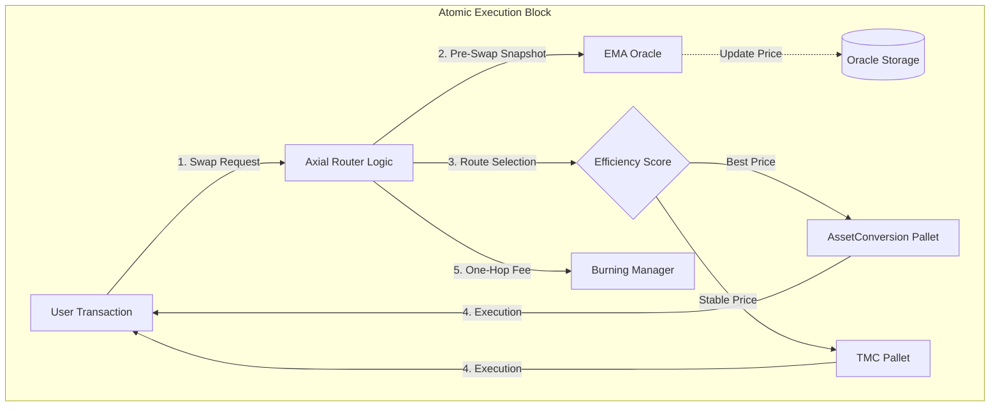

# Axial Router: Minimalist Multi-Token Routing Architecture

## Executive Summary

The Axial Router is a specialized **Deterministic Economic Automaton** designed for TMC (Token Minting Curve) ecosystems. Unlike general-purpose aggregators, it operates as a strict **Decision Engine** atop the parachain's internal liquidity.

It enforces a **Protocol-First** routing logic: instead of merely finding a path, it calculates an **Efficiency Score** to arbitrate between Market Liquidity (XYK Pools) and Protocol Liquidity (TMC Curves), using the Native token as the sole routing anchor.

## Architecture Overview

### Design Philosophy

1.  **Stateless Execution** - Zero intermediate buffers; logic operates purely on input balances.
2.  **Oracle-First Security** - Pricing models are updated _before_ execution to prevent intra-block manipulation.
3.  **Trustless Verification** - Execution results are verified via physical balance deltas, not theoretical quotes.
4.  **Native-Only Anchor** - Reduces graph complexity by using Native token as the universal hub.

### System Architecture


```mermaid
graph TD
    User[User Transaction] -->|1. Swap Request| Router[Axial Router Logic]

    subgraph "Atomic Execution Block"

    Router -->|2. Pre-Swap Snapshot| Oracle[EMA Oracle]
    Oracle -.->|Update Price| OracleStorage[(Oracle Storage)]

    Router -->|3. Route Selection| Decision{Efficiency Score}
    Decision -->|Best Price| XYK[AssetConversion Pallet]
    Decision -->|Stable Price| TMC[TMC Pallet]

    XYK -->|4. Execution| User
    TMC -->|4. Execution| User

    Router -->|5. One-Hop Fee| BurnMgr[Burning Manager]

    end
```

## Core Components

### Path Discovery Engine

The router utilizes a **Lazy Discovery** algorithm anchored by the Native token. It does not scan the entire graph but evaluates only economically viable paths:

1.  **Direct Path**: Source $\leftrightarrow$ Destination
2.  **Native-Anchored Path**: Source $\leftrightarrow$ **Native** $\leftrightarrow$ Destination
3.  **Protocol Path**: Source $\rightarrow$ **TMC Mint** $\rightarrow$ Native

### Route Mechanisms & Efficiency Score

The router is not passive; it actively selects the execution mechanism based on an **Efficiency Score**:

$$Score = Output - Fees - (PriceImpact \times Output \times PenaltyFactor)$$

This formula penalizes volatility. If a direct XYK swap has high slippage, the router will automatically prefer the TMC Minting path (if available), acting as an automated arbitrageur for the user.

### Fee Routing Architecture (Stateless & Secure)

The architecture implements **One-Hop Fee Routing**, eliminating the "Router Account" as a middleman for fees. Recent optimizations enhanced safety using `Preservation::Protect` and `KeepAlive` for robust account handling.

```rust
/// Fee routing adapter for direct fee transfer to burning manager
pub trait FeeRoutingAdapter<AccountId, AssetId, Balance> {
  /// Route fee directly from sender to burning manager account
  /// Logic: User -> BurningManager (0 hops through Router)
  fn route_fee(who: &AccountId, asset_id: AssetId, amount: Balance) -> DispatchResult;
}
```

**Benefits:**

- **Gas Efficiency:** Reduces transfer overhead by ~50%.
- **Storage Hygiene:** Removes `FeeBuffer` storage items, preventing state bloat.
- **Deflationary Velocity:** Fees are immediately available for burning/processing by the Burning Manager.
- **Account Safety:** Protected against dust attacks with existential deposit awareness.

## Runtime Configuration (Decoupled)

The runtime configuration now strictly adheres to trait bounds, decoupling the router from specific pallet implementations using `Inspect`.

```rust
use polkadot_sdk::frame_support::traits::fungible::Inspect as NativeInspect;
use polkadot_sdk::frame_support::traits::fungibles::{Inspect as FungiblesInspect, Mutate};
use polkadot_sdk::sp_runtime::{traits::AccountIdConversion, ArithmeticError, DispatchError, Permill, TokenError};
use crate::configs::assets_config::{AssetKind, NativeAssetId};

pub struct AssetConversionAdapter;

impl pallet_axial_router::AssetConversionApi<AccountId, AssetId, Balance>
  for AssetConversionAdapter
{
  // ... (pool_id and reserve logic) ...

  fn swap_exact_tokens_for_tokens(
    who: AccountId,
    path: Vec<AssetId>,
    amount_in: Balance,
    min_amount_out: Balance,
    recipient: AccountId,
    keep_alive: bool,
  ) -> Result<Balance, sp_runtime::DispatchError> {

    // 1. Identify Assets
    let target_asset_kind = path.last().map(to_asset_kind).ok_or(DispatchError::Other("Invalid asset path"))?;
    let target_asset_id = match target_asset_kind {
      AssetKind::Native => NativeAssetId::get(),
      AssetKind::Local(id) => id,
    };

    // 2. Snapshot Balance (Using Trait Abstraction)
    let balance_before = if target_asset_id == NativeAssetId::get() {
      <Balances as NativeInspect<AccountId>>::balance(&recipient)
    } else {
      <pallet_assets::Pallet<Runtime> as FungiblesInspect<AccountId>>::balance(target_asset_id, &recipient)
    };

    // 3. Execute Swap (Black Box)
    let boxed_path: Vec<Box<AssetKind>> = path.into_iter().map(to_asset_kind).map(Box::new).collect();
    AssetConversion::swap_exact_tokens_for_tokens(
      RuntimeOrigin::signed(who.clone()),
      boxed_path,
      amount_in,
      min_amount_out,
      recipient.clone(),
      keep_alive,
    )?;

    // 4. Verify Delta (Trustless)
    let balance_after = if target_asset_id == NativeAssetId::get() {
      <Balances as NativeInspect<AccountId>>::balance(&recipient)
    } else {
      <pallet_assets::Pallet<Runtime> as FungiblesInspect<AccountId>>::balance(target_asset_id, &recipient)
    };

    Ok(balance_after.saturating_sub(balance_before))
  }
}
```

## Oracle Security Architecture

### The "Pre-Swap" Invariant

To prevent Flash Loan attacks where an attacker manipulates the price _within_ a block to exploit the system, Axial Router updates the Oracle **before** the trade modifies the reserves. Recent optimizations include dynamic tracked assets via governance-controlled `TrackedAssets` storage.

```rust
/// Update oracle using pre-swap pool reserves to prevent manipulation
fn update_oracle_from_reserves(from: AssetId, to: AssetId) -> Result<(), Error<T>> {
  if let Some(pool_id) = T::AssetConversion::get_pool_id(from, to) {
    if let Some((res_a, res_b)) = T::AssetConversion::get_pool_reserves(pool_id) {

      // CRITICAL FIX: Directionality Detection
      // Ensures correct price (A/B or B/A) regardless of pool sort order (Low<High)
      let (reserve_in, reserve_out) = if pool_id.0 == from {
        (res_a, res_b)
      } else {
        (res_b, res_a) // Invert reserves for reverse swap
      };

      if !reserve_in.is_zero() {
        // Calculate Spot Price based on Reserves (not execution)
        let spot_price = reserve_out
          .saturating_mul(T::Precision::get())
          .saturating_div(reserve_in);

        T::PriceOracle::update_ema_price(from, to, spot_price, tvl)?;
      }
    }
  }
  Ok(())
}

/// Get tracked assets for oracle updates (from storage)
pub fn get_tracked_assets() -> Option<Vec<AssetId>> {
  let tracked = TrackedAssets::<T>::get();
  if tracked.is_empty() {
    None
  } else {
    Some(tracked)
  }
}
```

## Implementation Status

### Release Candidate 2: Post-Optimization ✅

The Axial Router has been optimized for pre-audit requirements with enhanced security, efficiency, and governance features.

#### ✅ Pre-Audit Optimizations

- **Permill Fee Math:** Migrated to `Permill` type with `mul_floor()` for accurate, overflow-safe calculations.
- **Error Standardization:** Replaced string errors with `TokenError` and `ArithmeticError` for better error handling.
- **Event Enrichment:** `FeeCollected` event now includes `source` and `collector` for improved indexing.
- **Dynamic Assets:** Added `TrackedAssets` storage and `add_tracked_asset` extrinsic for governance control.
- **Gas Optimization:** Eliminated double DB reads by passing pre-calculated outputs to validation.
- **Secure Calls:** Replaced Origin spoofing with direct `do_burn_internal` for TMC integration.
- **Account Safety:** Enhanced fee routing with `Preservation::Protect` and `KeepAlive`.

#### ✅ Critical Logic Validation

- **Oracle Inversion Fix:** The code correctly handles bidirectional swaps against sorted AMM pools.
- **Dust Protection:** `MinSwapForeign` is enforced at the extrinsic level (`ensure!`), preventing spam attacks.
- **Balance Integrity:** The `AssetConversionAdapter` relies on ledger reality (Delta), not theoretical return values.

#### ✅ Code Quality & Architecture

- **Zero-Copy Logic:** Where possible, assets are passed by ID.
- **Trait Decoupling:** Runtime configuration uses `Inspect` traits, reducing tight coupling to specific pallets.
- **Stateless Fees:** The Router pallet storage is minimized with governance-configurable oracle assets.

## Integration Roadmap

### Phase 1: Deployment (Current)

- Deploy `pallet-axial-router` to runtime.
- Configure `AssetConversionAdapter` to point to production `pallet-asset-conversion`.
- Set `FeeRoutingAdapter` to point to `BurningManager`.

### Phase 2: TMC Activation (Next)

- Replace current `TmcInterface` stub with live `pallet-tmc` calls.
- Enable `DirectMint` mechanism in `find_optimal_route`.

### Phase 3: Cross-Chain (Future)

- Extend `AssetKind` to support XCM MultiLocations.
- Enable XCM-based fee routing.

## Conclusion

Axial Router is a production-grade, security-hardened routing engine. By strictly enforcing **Pre-Swap Oracle Updates** and **Stateless Fee Routing**, it eliminates the most common attack vectors in DeFi (Flash Loans and Dust Attacks) while minimizing gas overhead.

It serves not just as a tool for swapping tokens, but as the **central nervous system** of the TMC economic model, ensuring that every trade flows through the path most beneficial to the protocol's liquidity depth.

---

**Version**: 2.0.0
**Last Updated**: December 2024
**Author**: LLB Lab
**License**: MIT
