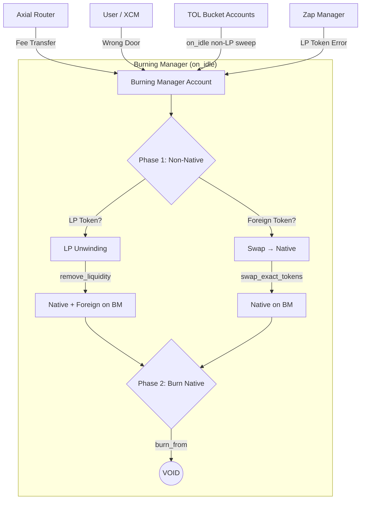

# Burning Manager: Deflationary Engine Architecture

> **On-Chain Account** (PalletId: `burnmgr0`)
> - SS58: `5EYCAe5fvqwE4RtLxrYen5uydn8ZHVAeuGodcPtqa8ZfkkUt`
> - Hex: `0x6d6f646c6275726e6d6772300000000000000000000000000000000000000000`

## Executive Summary

The Burning Manager is a `Passive Deflationary Actor` that converts all non-native tokens into native tokens and burns them, compressing the circulating supply. It operates as an `Omnivorous Sink`: any token arriving at its account — fees, erroneous transfers, or LP tokens — is systematically processed and destroyed.

It implements a strict two-phase `on_idle` cycle with LP token priority, ensuring that complex multi-step unwinding never blocks the critical burn path.

## Architecture Overview

### Design Philosophy

1. `Token-Driven Coordination`: Logic triggered by balance presence (`on_idle`), not user extrinsics.
2. `Omnivorous Intake`: Processes any asset arriving at its account — router fees, TOL non-LP bucket sweeps, "Wrong Door" deposits, and LP tokens.
3. `Two-Phase Execution`: Phase 1 converts non-native → native. Phase 2 burns all native unconditionally.
4. `LP Priority`: LP tokens are unwound before foreign swaps, preventing compounding positions.
5. `One Operation Per Block`: Phase 1 processes exactly one non-native asset, keeping weight predictable.
6. `Singleton Burn Domain`: Burning Manager remains a single global runtime actor; no per-token/per-domain BM instancing is planned.

### System Architecture



## Core Logic: The Two-Phase Cycle

### Phase 1: Process One Non-Native Asset

Scans `BurnableAssets` with round-robin index (`LastProcessedIndex`). LP tokens have strict priority.

`Pass 1 — LP tokens (priority)`:

- Iterate all burnable assets from current index
- If `asset.is_lp()` and balance > 0 → `process_lp_unwinding`
- LP is decomposed into constituent tokens via `remove_liquidity`
- Constituents (native + foreign) remain on BM account

`Pass 2 — Foreign tokens (if no LP found)`:

- Iterate all burnable assets from current index
- Skip `Native` and LP tokens
- If balance > 0 and quote ≥ `DustThreshold` → `process_foreign_swap`
- Foreign tokens are swapped to native via AMM

`One operation per block.` Index advances after each processed asset.

### Phase 2: Burn All Native

Unconditionally checks native balance on BM account. If > 0, burns everything via `Currency::burn_from`. This catches:

- Original fee deposits (native)
- Swap proceeds from Phase 1
- Native portion from LP unwinding
- Accumulated native from previous blocks

### LP Unwinding

LP token IDs (`0x4000_XXXX`) don't encode their constituent pair in the bitmask. Resolution uses `get_pool_pair_for_lp` which iterates `pallet_asset_conversion::Pools` storage (O(N), N ≤ 100 pools).

After `remove_liquidity`, constituent tokens stay on BM account:

- `Native portion` → burned in Phase 2 of the same block
- `Foreign portion` → swapped in Phase 1 of the next block

This separation ensures LP unwinding is a clean, atomic operation.

## Core Components

### 1. Burnable Assets Registry (`BurnableAssets`)

Governance-controlled `BoundedVec<AssetKind, 100>` of assets to process. Prevents DoS from dust flooding.

```rust
#[pallet::storage]
pub type BurnableAssets<T: Config> = StorageValue<
    _, BoundedVec<AssetKind, ConstU32<100>>, ValueQuery,
>;
```

### 2. Round-Robin Processing (`LastProcessedIndex`)

Ensures fair processing across all registered assets. Advances after each Phase 1 operation.

### 3. Oracle-Protected Swaps

Foreign → Native swaps use oracle price for slippage protection:

```rust
let expected_out = amount * oracle_price / PRECISION;
let min_amount_out = slippage_tolerance.mul_floor(expected_out);
```

### 4. Governance Parameters

| Parameter           | Default  | Description                               |
| :------------------ | :------- | :---------------------------------------- |
| `DustThreshold`     | 0.1 UNIT | Minimum value (in Native) to trigger swap |
| `SlippageTolerance` | 2%       | Maximum slippage for foreign swaps        |

All parameters updatable via `AdminOrigin` extrinsics.

## Ecosystem Integration

### Connection to Axial Router (Primary Inflow)

The Router sends fees directly to the BM account via one-hop transfer. Fee amount = `AXIAL_ROUTER_FEE` (0.5%) of each swap. Native fees accumulate for Phase 2. Foreign fees are swapped in Phase 1.

### Connection to TOL (Bucket Purity Sink)

TOL `on_idle` sweeps non-LP residues from bucket accounts to BM (`NonLpAssetSwept`).

- `Result`: bucket accounts remain LP-only by runtime invariant.
- `BM Role`: convert swept foreign tokens to native and burn native in the standard two-phase cycle.
- `Boundary`: TOL does not send bucket LP to BM in normal flow; LP handling in BM remains an edge-case safety path.

### Connection to TMC (Indirect Supply Compression)

BM doesn't interact with TMC directly. But every native burn reduces `TotalIssuance`, which TMC reads live via `effective_supply = total_issuance - initial_issuance`. Burns lower the ceiling price, creating `bidirectional compression` with the TOL floor.

### Connection to Zap Manager (LP Edge Case)

If LP tokens accidentally arrive at BM (misconfigured transfer, governance error), the LP unwinding pipeline decomposes them into constituent tokens. This prevents permanent capital lock.

## Events

| Event                                                                     | Description                           |
| :------------------------------------------------------------------------ | :------------------------------------ |
| `NativeTokensBurned { amount, new_total }`                                | Native tokens destroyed               |
| `ForeignTokensSwapped { foreign_asset, foreign_amount, native_received }` | Foreign → Native swap completed       |
| `LpUnwound { lp_asset, lp_amount, asset1, amount1, asset2, amount2 }`     | LP token decomposed into constituents |
| `MinBurnUpdated`, `DustThresholdUpdated`, `SlippageToleranceUpdated`      | Governance parameter changes          |

## Block Lifecycle

```
Block N (on_idle):
  Phase 1: Found LP token (0x4000_002A) with 100 UNIT balance
           → remove_liquidity → 50 UNIT Native + 50 UNIT Foreign on BM
  Phase 2: Burn 50 UNIT Native (from LP unwinding)

Block N+1 (on_idle):
  Phase 1: Found Foreign(1) with 50 UNIT balance
           → swap → 47.5 UNIT Native on BM
  Phase 2: Burn 47.5 UNIT Native (swap proceeds)

Block N+2 (on_idle):
  Phase 1: No non-native balances → skip
  Phase 2: No native balance → skip
```

## Implementation Status

- `Mechanism`: Reactive / on_idle (Weight-bounded).
- `Strategy`: Two-phase (convert → burn), LP priority.
- `Security`: Oracle-gated swaps + Governance whitelist.
- `LP Resolution`: Pool iteration (O(N), N ≤ 100).
