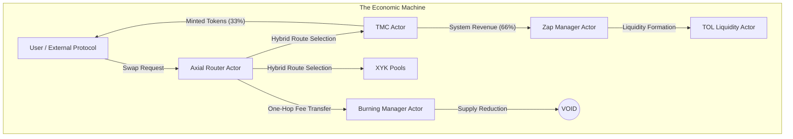

# TMCTOL Core Architecture: The Token-Driven Economic Automaton

## 1. Executive Summary

The TMCTOL (Token Minting Curve with Treasury-Owned Liquidity) framework represents a paradigm shift from event-driven blockchain logic to a `Token-Driven Economic Automaton`.

The system operates as a deterministic state machine where specialized actors (Router, Treasury, Manager) operate exclusively on `Balance Ingress`. It abandons the traditional "Request-Response" model in favor of `Continuous Flow Processing`. The network coordinates through explicit, permissionless token flows between dedicated accounts, ensuring that every state transition is mathematically bounded, economically productive, and immune to intra-block manipulation.

This architecture eliminates latency-induced arbitrage and ensures maximal resource utilization by combining `Reactive Hooks` for immediate triggers with `Weight-Based Processing` for heavy computations.

## 2. Core Philosophy: The "Omnivorous" Machine

### 2.1 The Coordination Rule

The entire network follows a single, immutable coordination rule:

> `Balance-in → Deterministic State Transition → Balance-out`

### 2.2 Key Architectural Properties

1.  `Origin-Agnostic`: Actors do not validate _who_ sent the tokens. They only validate _what_ arrived. This makes the system permissionless and interoperable by default.
2.  `Stateless Execution`: The system minimizes on-chain storage. Intermediate buffers are removed; flows are direct (One-Hop).
3.  `Graceful Degradation`: The system is "economically omnivorous." Erroneous transfers (e.g., a user sending funds directly to the Burn Manager) are not lost errors—they are processed as valid economic contributions (e.g., burnt or added to liquidity).
4.  `Reactive Resilience`: The system applies backpressure ("RetryCooldown") instead of failing catastrophically. If conditions are unsafe (e.g., Oracle deviation), actors pause processing for a specific asset rather than halting the chain.

## 3. Actor Architecture & Economic Topology

### 3.1 The Actor Constellation



### 3.2 Type System Foundation: The Bitmask Architecture

To guarantee O(1) execution complexity and maximal interoperability, the architecture relies on a high-performance `Bitmask Identification Strategy` implemented in `primitives/src/assets.rs`.

#### 3.2.1 Asset Taxonomy

Instead of rigid enums, the system utilizes a 32-bit ID space where the most significant 4 bits determine the asset category:

| Prefix | Mask     | Category   | Description                |
| :----- | :------- | :--------- | :------------------------- |
| `0x0`  | `0x0...` | `Native`   | Platform token (NATIVE)    |
| `0x1`  | `0x1...` | `Standard` | Regular tokens (DOT, KSM)  |
| `0x2`  | `0x2...` | `Stable`   | Stablecoins (USDT, USDC)   |
| `0x3`  | `0x3...` | `vToken`   | Liquid Staking Derivatives |
| `0x4`  | `0x4...` | `LP Token` | Liquidity Pool Shares      |
| `0xF`  | `0xF...` | `Foreign`  | XCM Assets                 |

> `AssetKind::Foreign(u32)`: Foreign/XCM assets are mapped deterministically via `LocationToAssetId` into the 0xF… namespace in `pallet-assets`, sharing the same ledger as local assets but remaining type-isolated at the enum level for O(1) inspection and routing. Governance flow: create asset + set metadata (symbol/decimals/ED, optional sufficient) for the deterministic ID before enabling the channel. Invariants: `LocationToAssetId` mapping is immutable once set, whitelist of processed assets stays bounded (O(N) on_initialize), ED/sufficiency configured per foreign asset to avoid dust/DoS.

#### 3.2.2 Zero-Cost Abstractions

This architecture enables "Zero-Cost Inspection" where complex economic properties are verified via bitwise operations rather than storage reads.

- `Asset Classification`: Automatically detects asset types (Stable, vToken, LP, Foreign) via bitmask matching for routing decisions.
- `Routing Logic`: The Router uses bitmask inspection to determine optimal paths (e.g., Native-anchored multi-hop for non-Native pairs) without storage lookups.
- `Security`: Namespace isolation prevents LP token ID collisions with Standard Tokens. On clean-slate genesis, `NextPoolAssetId` is initialized into `TYPE_LP` space so newly minted pool LP IDs are `AssetKind::is_lp()`-detectable by bitmask.

> `Fee Policy`: All asset pairs pay the same flat Router fee (default 0.5%). No discounts or special rates based on asset type. Fee rate is configurable via governance.

### 3.3 Actor Responsibilities

#### 🧠 Axial Router Actor (The Decision Engine)

_The intellectual layer atop raw liquidity._

- `Function`: Intelligent Aggregation. It does not just "route"; it calculates an `Efficiency Score` to choose between:
  - `Market Liquidity`: Standard XYK Swaps.
  - `Protocol Liquidity`: Direct Minting via TMC (if mathematically superior).
  - `Complex Paths`: Multi-hop Native-anchored routes.
- `Security Feature`: `Pre-Swap Oracle Update`. The router snapshots pool reserves _before_ execution to update the Oracle. This renders the system immune to Flash Loan attacks, as the Oracle records the "fair" price, not the "manipulated" execution price.
- `Execution`: Uses `Balance-Delta Verification` (Trustless Execution). It measures the physical change in the recipient's balance rather than relying on theoretical quotes.

#### 📉 TMC Actor (The Ceiling)

_The algorithmic issuer._

- `Function`: Unidirectional token emission along a linear price curve.
- `Role`: Sets the "Hard Ceiling" on price. If market price > curve price, the Router automatically routes trades through TMC, creating arbitrage that feeds the protocol.

#### 🔥 Burning Manager Actor (The Sink)

_The deflationary engine._

- `Function`: Passive accumulation and destruction via two-phase `on_idle` cycle.
- `Phase 1`: Converts one non-native asset per block. LP tokens have priority (unwound via `remove_liquidity`), then foreign tokens are swapped to native via AMM.
- `Phase 2`: Burns ALL native tokens on BM account unconditionally — original fees, swap proceeds, and LP unwinding constituents.
- `Security`: Oracle-gated slippage protection on foreign swaps. Governance-controlled burnable assets whitelist.
- `Domain Model`: singleton by design — one global Burning Manager sink for native-supply compression.

#### ⚡ Zap Manager Actor (The Transformer)

_The liquidity compositor._

- `Function`: Turns raw assets into yield-bearing positions (LP).
- `Logic`: Auto-compounds system revenue into Protocol Owned Liquidity (POL).
- `Output`: Minted LP tokens are transferred to token-resolved TOL ingress accounts (`AssetId -> TolId`); bucket distribution is performed by TOL via `receive_lp_tokens` when that call is triggered by integration/automation flow.

#### 🏛️ TOL Actor (The Floor)

_The volatility dampener._

- `Function`: Manages the "Hard Floor" via distinct liquidity buckets with fractal symmetry distribution. TOL is configured as a `tol_id`-scoped runtime actor with domain-local bucket/queue/buffer state and distributes incoming LP tokens across domain buckets according to configured allocations.
- `Bucket Purity Automation`: `on_idle` sweep moves non-LP residue from bucket accounts to Burning Manager, keeping buckets LP-only by design.
- `LP Ingress Gate`: TOL accepts LP distribution inputs only when `lp_asset.is_lp()`.
- `Buckets` (defined in `primitives/src/ecosystem.rs`):
  - _Bucket A — Anchor (50%):_ Primary floor defense liquidity. This is the mathematical survival layer.
  - _Bucket B — Building (16.7%):_ Ecosystem construction budget (engineering, infra, tooling, integrations). Periodic treasury operations are planned via DripVault (roadmap), with governance-manual unwind as the current fallback.
  - _Bucket C — Capital (16.7%):_ Operational liquidity bucket. Gradual LP unwinding into treasury-held Native/Foreign is planned via DripVault (roadmap), with governance-manual unwind in the current stage.
  - _Bucket D — Dormant (16.6%):_ LP reserve parked for future governance activation when timing is favorable.
- `DripVault Direction`: planned as a configurable time-controller via account abstraction for both system and user accounts, enabling scheduled on-chain execution of policy-defined extrinsics (including, but not limited to, bucket operations).

### 3.4 Token Lifecycle Orchestration (Phased Evolution)

Core architecture treats token onboarding as a two-phase process.

Current phase status:

- `Implemented now`: token-to-TOL domain routing + TOL domain state isolation (`AssetId`-keyed domains, domain-scoped buckets/queues/buffers)
- `Implemented now`: runtime glue hooks on Asset Registry registration and TMC curve activation bootstrap domain binding idempotently and enable Zap processing
- `Planned next`: richer lifecycle checkpoints and deeper per-domain policy templates (without introducing a God-pallet)

Core process model:

1. `Asset Registration` (identity layer)
   - Asset is registered and type-classified in Asset Registry (`Location -> AssetId` / namespace safety)
   - Runtime glue may bootstrap deterministic default domain state for the token

2. `Economic Activation` (policy layer)
   - Governance selects emission mode (`standard TMCTOL` or token-specific custom policy)
   - Activating TMC for a token confirms/updates token-domain coupling and enables Zap processing for that token
   - Manual override remains available via governance binding extrinsics when custom domain mapping is required

Target operational convention:

- aligned token-domain keying across token-linked TMC, Zap, and TOL flows (default `domain_id = token_asset_id`)
- singleton compatibility remains as baseline domain (`tol_id = 0`)
- token-scoped domains are used for L2 profiles

Canonical `$BLDR` target profile:

- TOL policy is Anchor-focused (permanent liquidity behavior in bucket `A`)
- emission target is approximately `1/3 buyer`, `1/3 treasury`, `1/3 liquidity path`
- if buyer context is L2 Bucket `B`, buyer tranche is burned immediately (route-agnostic: TMC or XYK), reducing effective supply ceiling

Governance constraint envelope:

- onboarding is governance-gated
- expected token set is bounded (up to ~1000 high-complexity ecosystem tokens)
- each L2 token is expected to have a dedicated TOL domain and, ideally, its own DAO policy layer

### 3.5 Antifragile Lifecycle Risk Envelope

To keep automation robust without overengineering, lifecycle glue follows a strict antifragile envelope:

- `Fail-fast over silent drift`: if domain bootstrap cannot complete (for example, domain capacity reached), the triggering call fails instead of partially applying hidden state.
- `Idempotent checkpoints`: repeated registration/activation calls must converge to the same state without duplicate domains or conflicting bindings.
- `Observable automation`: lifecycle progress should be visible via compact milestone events, not implicit storage side effects only.
- `Domain fairness roadmap`: as token count grows, execution fairness is expanded through domain-aware scheduling (starting with Zap), preventing one domain from starving others.

### 3.6 Token Lifecycle Checkpoint Runbook (Operational)

Canonical onboarding checkpoints:

| Checkpoint                      | Action                                                            | Expected events                                                                  | Required checks                                                                                  |
| :------------------------------ | :---------------------------------------------------------------- | :------------------------------------------------------------------------------- | :----------------------------------------------------------------------------------------------- |
| `CP-1 Asset Registration`       | `AssetRegistry::register_foreign_asset*` or `link_existing_asset` | `TolCreated` (first-time only) → `TokenDomainEnsured` → `ForeignAssetRegistered` | `location_to_asset` set, `tokenTolBinding` exists, `tolConfiguration` exists                     |
| `CP-2 Curve Activation`         | `TokenMintingCurve::create_curve(...)`                            | `TokenDomainEnsured` → `AssetEnabled` → `CurveCreated`                           | curve exists, Zap enabled, binding points to expected domain                                     |
| `CP-3 Mint Smoke`               | run mint through router/TMC path                                  | `ZapAllocationDistributed` (+ Zap processing events when conditions are met)     | balances move through expected TMC → Zap path                                                    |
| `CP-4 LP Distribution Boundary` | integration/automation trigger for `TOL::receive_lp_tokens`       | TOL bucket distribution events when integration trigger is present               | LP always reaches resolved TOL ingress even when direct TOL call is not auto-fired by Zap pallet |

Manual override rule:

- If governance binds `token_asset` to `custom_tol_id`, ensure logic preserves that override and hardens the bound domain.

## 4. Deterministic Execution via Substrate Hooks

The system leverages the full Substrate block lifecycle to guarantee economic invariants while optimizing block weight usage.

### 4.1 The "Omnivorous State Scanner" Pattern

To ensure absolute robustness against "Wrong Door" deposits and diverse origin vectors (XCM, Minting, Transfers), the system employs a `State-Based Automation` model for key actors like the `Zap Manager`.

- `Mechanism`: Poll-based scanning of `EnabledAssets` in `on_initialize`.
- `Trade-off`: O(N) complexity per block (where N is whitelisted assets) vs O(1) implementation simplicity and "Omnivorous" reliability.
- `Logic`:
  1.  `Scan`: Iterate through enabled assets.
  2.  `Check`: Verify balance > `MinThreshold`.
  3.  `Execute`: If conditions met, trigger logic. If conditions fail (e.g. Oracle), set `Cooldown`.

### 4.2 Reactive Resilience (Backpressure)

The system implements "Economic Backpressure" to handle volatility gracefully.

- `Problem`: If Price Oracle deviates significantly, executing a Zap is dangerous (Sandwich Attack risk).
- `Solution`: Instead of reverting (wasting gas) or forcing a bad trade, the system `Locks` the asset for a cooldown period (e.g., 10 blocks).
- `Result`: The system "waits out" the volatility or attack, resuming only when conditions stabilize.

### 4.3 `on_initialize` (The Scanner)

- `Purpose`: Lightweight state detection and bounded queue draining.
- `Actors`: Zap Manager and TOL. Burning Manager operates entirely in `on_idle`.
- `Actions` (Zap Manager):
  - Scans `EnabledAssets` balances on Zap account.
  - Validates cooldown state (`NextZapAttempt`).
  - Populates `PendingZaps` for `on_idle` execution.
- `Actions` (TOL):
  - Drains `PendingRequests[tol_id]` across active domains.
  - Accumulates drained allocations into domain-local `ZapBufferState[tol_id]`.

### 4.4 `on_idle` (The Processor)

- `Purpose`: Heavy lifting within remaining block weight.
- `Actors`: Zap Manager, Burning Manager, and TOL.
- `Zap Manager`: Drains `PendingZaps`, executes opportunistic zaps until weight exhausted. Unprocessed items re-inserted for next block.
- `Burning Manager`: Two-phase cycle:
  - Phase 1: Process ONE non-native asset (LP unwinding priority, then foreign swap).
  - Phase 2: Burn ALL native tokens on BM account (including swap proceeds from Phase 1).
- `TOL`: Executes bounded non-LP bucket sweeps to Burning Manager, preserving LP-only bucket invariant.
- Uses round-robin cursors for fairness in long-running asset sets.

## 5. Code Integration Patterns

### 5.1 Trustless Execution Pattern

The Router does not trust the return value of the AMM. It verifies the physical reality of the ledger using type-safe inspection.

```rust
// AssetConversionAdapter
fn swap_exact_tokens_for_tokens(...) -> Result<Balance, DispatchError> {
    // 1. Type-Safe Snapshot
    let balance_before = match target_asset {
        AssetKind::Native => T::Currency::balance(&recipient),
        AssetKind::Local(id) => T::Assets::balance(id, &recipient),
    };

    // 2. Execute (Black Box)
    AssetConversion::swap_exact_tokens_for_tokens(...)?;

    // 3. Verify Delta
    let balance_after = match target_asset {
        AssetKind::Native => T::Currency::balance(&recipient),
        AssetKind::Local(id) => T::Assets::balance(id, &recipient),
    };

    let actual_amount = balance_after.saturating_sub(balance_before);

    Ok(actual_amount)
}
```

### 5.2 Flash-Loan Resistant Oracle Pattern

The system updates the pricing model based on the state _before_ the transaction distorts it.

```rust
// Pallet::swap
pub fn swap(from: AssetKind, to: AssetKind, ...) -> DispatchResult {
    // Security: Update Oracle using Pre-Swap Reserves
    // This creates an invariant pricing model within the block
    Self::update_oracle_from_reserves(from, to)?;

    // Execution: Now safe to trade
    Self::execute_optimal_route(...)?;

    Ok(())
}
```

### 5.3 Two-Phase Hook Architecture

Decoupling detection from execution via lightweight scanning and weight-bounded processing.

```rust
// Zap Manager: on_initialize populates PendingZaps (lightweight scan)
// Zap Manager: on_idle processes PendingZaps with weight budget
//
// TOL: on_initialize drains PendingRequests[tol_id] into domain ZapBufferState[tol_id]
// TOL: on_idle sweeps non-LP residue from bucket accounts to Burning Manager
//
// Burning Manager: on_idle only (no on_initialize)
//   Phase 1: process one non-native (LP priority → foreign swap)
//   Phase 2: burn all native unconditionally
//
// pallet-assets lacks per-transfer callbacks, so push-based notification
// is not available. Storage-backed queues/cursors preserve decoupling:
// scan/drain phase (on_initialize) and execution phase (on_idle)
// each run within explicit per-block bounds.
impl pallet_assets::Config for Runtime {
    // ...
    type CallbackHandle = (); // No per-transfer hook in pallet-assets
}
```

### 5.4 Unified Type System Pattern

Centralizing type definitions to break dependency cycles.

```rust
// runtime/src/configs/assets_config.rs
pub use primitives::AssetKind;

// pallet-axial-router/src/types.rs
pub use primitives::AssetKind;
```

## 6. Network Architecture: The Connected Automaton

The TMCTOL system extends its "Omnivorous" philosophy to the Polkadot ecosystem via XCM (Cross-Consensus Messaging), treating foreign chains as just another source of balance ingress.

### 6.1 XCM Integration Strategy

The parachain acts as a `Sovereign Liquidity Hub`, accepting assets from Relay Chain and Sibling Parachains after governance registration in the Asset Registry.

> Coretime requirement: on paseo-local (and other relay chains), the parachain must acquire on-demand coretime to produce/finalize blocks. In practice, run a relay-side extrinsic (e.g., via pop call chain) `OnDemand::place_order` with `para_id = 2000` and an appropriate `max_amount` to start block production.

- `Ingress Protocol`: The system accepts `ReserveAssetDeposited` and `Teleport` instructions.
- `Asset Mapping (Hybrid)`: `Location -> AssetId` stored on-chain in the Asset Registry; IDs generated once at registration (hash(Location)) and persisted. Protects against XCM version drift (v5→v6) via key migration without changing `AssetId`.
- `Holding Register`: Incoming assets are held in a temporary register before being dispatched to the `ForeignAssetsTransactor`.

### 6.2 Foreign Asset Transactor

The `ForeignAssetsTransactor` (configured in `xcm_config.rs`) provides the bridge between XCM locations and the internal `pallet-assets` registry.

- `Storage Lookup`: Uses the Asset Registry mapping (O(1) storage) to resolve `Location -> AssetId` (`0xF...` namespace). No on-the-fly hashing in production flow.
- `Governance-Gated Onboarding`: New assets are registered via registry extrinsics (deterministic ID, manual ID, or linking pre-created `0xF...`), then consumed by XCM flows.
- `Deterministic Domain Bootstrap`: Runtime hook wiring can bootstrap token-domain state (`AssetId`-keyed TOL binding/domain) immediately at registration while keeping registration governance-gated.

### 6.3 Cross-Chain Identity

- `Sovereignty`: The parachain maintains sovereign accounts on other chains to manage its own liquidity reserves.
- `Sibling Recognition`: `ForeignAssetsFromSibling` filter ensures that assets originating from sibling parachains are recognized as valid reserve assets, enabling seamless cross-chain swaps.

## 7. Economic Guarantees

### 7.1 The Price Corridor

The interaction of actors creates a mathematically bounded economy:

- `Ceiling`: Enforced by TMC Actor (Infinite supply at Curve Price).
- `Floor`: Enforced by TOL Actor (Deep Protocol-Owned Liquidity).
- `Result`: Reduced volatility and guaranteed liquidity depth, regardless of external market makers.

### 7.2 Deflationary Velocity

The `Axial Router` acts as a vacuum for circulating supply.

- `Mechanism`: High base fee (e.g., 0.5%) + Protocol Priority Routing.
- `Outcome`: System value capture is prioritized over LP revenue. The protocol captures the spread to burn its own supply.

## 8. Conclusion

The TMCTOL architecture transforms the blockchain from a passive ledger into an `Active Economic Automaton`.

By stripping away complex event listeners and origin checks, and replacing them with `Hook-Based Determinism` and `Stateless Token Flows`, the system achieves:

1.  `Maximum Security`: Immune to Flash Loans and Dust Attacks.
2.  `Zero Latency`: Reactive hooks ensure immediate state flagging upon token receipt.
3.  `Optimal Performance`: Heavy computation is shifted to `on_idle` via weight-based scheduling, preventing block bloat.
4.  `Total Autonomy`: The economy runs itself, cleaning up dust and rebalancing liquidity automatically in every block cycle.

This is the blueprint for a self-sustaining, deflationary DeFi primitive.

---

- `Version`: 2.0.0
- `Last Updated`: February 2026
- `Author`: LLB Lab
- `License`: MIT
