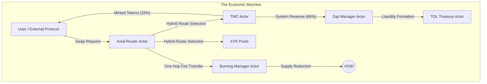

# TMCTOL Core Architecture: The Token-Driven Economic Automaton

## 1. Executive Summary

The TMCTOL (Token Minting Curve with Treasury-Owned Liquidity) framework represents a paradigm shift from event-driven blockchain logic to a **Token-Driven Economic Automaton**.

The system operates as a deterministic state machine where specialized actors (Router, Treasury, Manager) operate exclusively on **Balance Ingress**. It abandons the traditional "Request-Response" model in favor of **Continuous Flow Processing**. The network coordinates through explicit, permissionless token flows between dedicated accounts, ensuring that every state transition is mathematically bounded, economically productive, and immune to intra-block manipulation.

This architecture eliminates latency-induced arbitrage and ensures maximal resource utilization by combining **Reactive Hooks** for immediate triggers with **Weight-Based Processing** for heavy computations.

## 2. Core Philosophy: The "Omnivorous" Machine

### 2.1 The Coordination Rule

The entire network follows a single, immutable coordination rule:

> **Balance-in $\rightarrow$ Deterministic State Transition $\rightarrow$ Balance-out**

### 2.2 Key Architectural Properties

1.  **Origin-Agnostic**: Actors do not validate _who_ sent the tokens. They only validate _what_ arrived. This makes the system permissionless and interoperable by default.
2.  **Stateless Execution**: The system minimizes on-chain storage. Intermediate buffers are removed; flows are direct (One-Hop).
3.  **Graceful Degradation**: The system is "economically omnivorous." Erroneous transfers (e.g., a user sending funds directly to the Burn Manager) are not lost errors—they are processed as valid economic contributions (e.g., burnt or added to liquidity).
4.  **Reactive Resilience**: The system applies backpressure ("RetryCooldown") instead of failing catastrophically. If conditions are unsafe (e.g., Oracle deviation), actors pause processing for a specific asset rather than halting the chain.

## 3. Actor Architecture & Economic Topology

### 3.1 The Actor Constellation


```mermaid
graph TD
    User[User / External Protocol] -->|Swap Request| Router[Axial Router Actor]

    subgraph "The Economic Machine"

    Router -->|Hybrid Route Selection| TMC[TMC Actor]
    Router -->|Hybrid Route Selection| AMM[XYK Pools]
    Router -->|One-Hop Fee Transfer| BurnMgr[Burning Manager Actor]

    TMC -- "Minted Tokens (33%)" --> User
    TMC -- "System Revenue (66%)" --> ZapMgr[Zap Manager Actor]

    ZapMgr -- "Liquidity Formation" --> TOL[TOL Treasury Actor]

    BurnMgr -- "Supply Reduction" --> Null((VOID))

    end
```

### 3.2 Type System Foundation: The Bitmask Architecture

To guarantee O(1) execution complexity and maximal interoperability, the architecture relies on a high-performance **Bitmask Identification Strategy** implemented in `primitives`.

#### 3.2.1 Asset Taxonomy

Instead of rigid enums, the system utilizes a 32-bit ID space where the most significant 4 bits determine the asset category:

| Prefix | Mask     | Category     | Description                |
| :----- | :------- | :----------- | :------------------------- |
| `0x0`  | `0x0...` | **Native**   | Platform token (NATIVE)    |
| `0x1`  | `0x1...` | **Standard** | Regular tokens (DOT, KSM)  |
| `0x2`  | `0x2...` | **Stable**   | Stablecoins (USDT, USDC)   |
| `0x3`  | `0x3...` | **vToken**   | Liquid Staking Derivatives |
| `0x4`  | `0x4...` | **LP Token** | Liquidity Pool Shares      |
| `0xF`  | `0xF...` | **Foreign**  | XCM Assets                 |

> `AssetKind::Foreign(u32)`: Foreign/XCM assets are mapped deterministically via `LocationToAssetId` into the 0xF… namespace in `pallet-assets`, sharing the same ledger as local assets but remaining type-isolated at the enum level for O(1) inspection and routing. Governance flow: create asset + set metadata (symbol/decimals/ED, optional sufficient) for the deterministic ID before enabling the channel. Invariants: `LocationToAssetId` mapping is immutable once set, whitelist of processed assets stays bounded (O(N) on_initialize), ED/sufficiency configured per foreign asset to avoid dust/DoS.

#### 3.2.2 Zero-Cost Abstractions

This architecture enables "Zero-Cost Inspection" where complex economic properties are verified via bitwise operations rather than storage reads.

- **Stable Swap Detection**: Automatically detects pairs like Stable-to-Stable or vToken-to-Underlying via bitmask matching.
- **Fee Logic**: Dynamic fee adjustments (e.g., 50% discount for Stablecoins) are calculated instantly without looking up asset metadata.
- **Security**: Namespace isolation prevents LP token ID collisions with Standard Tokens.

### 3.3 Actor Responsibilities

#### 🧠 Axial Router Actor (The Decision Engine)

_The intellectual layer atop raw liquidity._

- **Function**: Intelligent Aggregation. It does not just "route"; it calculates an **Efficiency Score** to choose between:
  - **Market Liquidity**: Standard XYK Swaps.
  - **Protocol Liquidity**: Direct Minting via TMC (if mathematically superior).
  - **Complex Paths**: Multi-hop Native-anchored routes.
  - **Asset-Aware Optimization**: Applies StableSwap invariants for `0x2...` assets and discounted fees for Liquid Staking `0x3...` pairs.
- **Security Feature**: **Pre-Swap Oracle Update**. The router snapshots pool reserves _before_ execution to update the Oracle. This renders the system immune to Flash Loan attacks, as the Oracle records the "fair" price, not the "manipulated" execution price.
- **Execution**: Uses **Balance-Delta Verification** (Trustless Execution). It measures the physical change in the recipient's balance rather than relying on theoretical quotes.

#### 📉 TMC Actor (The Ceiling)

_The algorithmic issuer._

- **Function**: Unidirectional token emission along a linear price curve.
- **Role**: Sets the "Hard Ceiling" on price. If market price > curve price, the Router automatically routes trades through TMC, creating arbitrage that feeds the protocol.

#### 🔥 Burning Manager Actor (The Sink)

_The deflationary engine._

- **Function**: Passive accumulation and destruction.
- **Mechanism**: **One-Hop Collection**. Fees move directly `User -> Burning Manager`, bypassing the Router account entirely to save gas and storage.
- **Logic**: Aggregates "dust" and executes batched burns or swap-and-burns via deterministic hooks.

#### ⚡ Zap Manager Actor (The Transformer)

_The liquidity compositor._

- **Function**: Turns raw assets into yield-bearing positions (LP).
- **Logic**: Auto-compounds system revenue into Protocol Owned Liquidity (POL).
- **Routing**: Implements **Asset-Based Routing** via Storage Map, directing specific tokens to specific treasuries (e.g., "ETH-LP -> Treasury A", "DOT-LP -> Treasury B") without requiring multiple pallet instances.

#### 🏛️ TOL Actor (The Floor)

_The volatility dampener._

- **Function**: Manages the "Hard Floor" via distinct liquidity buckets.
- **Buckets**:
  - _Floor Bucket:_ Permanent, locked liquidity.
  - _Operational Bucket:_ Ecosystem growth (capped).
  - _Overflow Bucket:_ Emergency reserves.

## 4. Deterministic Execution via Substrate Hooks

The system leverages the full Substrate block lifecycle to guarantee economic invariants while optimizing block weight usage.

### 4.1 The "Omnivorous State Scanner" Pattern

To ensure absolute robustness against "Wrong Door" deposits and diverse origin vectors (XCM, Minting, Transfers), the system employs a **State-Based Automation** model for key actors like the `Zap Manager`.

- **Mechanism**: Poll-based scanning of `EnabledAssets` in `on_initialize`.
- **Trade-off**: O(N) complexity per block (where N is whitelisted assets) vs O(1) implementation simplicity and "Omnivorous" reliability.
- **Logic**:
  1.  **Scan**: Iterate through enabled assets.
  2.  **Check**: Verify balance > `MinThreshold`.
  3.  **Execute**: If conditions met, trigger logic. If conditions fail (e.g. Oracle), set **Cooldown**.

### 4.2 Reactive Resilience (Backpressure)

The system implements "Economic Backpressure" to handle volatility gracefully.

- **Problem**: If Price Oracle deviates significantly, executing a Zap is dangerous (Sandwich Attack risk).
- **Solution**: Instead of reverting (wasting gas) or forcing a bad trade, the system **Locks** the asset for a cooldown period (e.g., 10 blocks).
- **Result**: The system "waits out" the volatility or attack, resuming only when conditions stabilize.

### 4.3 `on_initialize` (The Shield & Trigger)

- **Purpose**: Invariant Enforcement & Automated Execution.
- **Actions**:
  - Scans for actionable states (Balances > Threshold).
  - Validates Oracle data integrity.
  - Applies Backpressure (skips processing for cooled-down assets).

### 4.3 `on_finalize` (The Settlement)

- **Purpose**: State Commitment.
- **Actions**:
  - TMC commits the final minting curve state.
  - Finalizes any atomic state transitions that must occur at block end.

### 4.4 `on_idle` (The Processor)

- **Purpose**: Heavy Lifting & Cleanup.
- **Mechanism**: **Weight-Based Processing**. The system checks `PendingProcessing` (populated by the Reactive Trigger) and processes items until the block's remaining weight is consumed.
- **Actions**:
  - Executes swaps for Zap Manager (Asset -> LP).
  - Executes "swap-and-burn" for Burning Manager.
  - Rebalances TOL buckets.
  - Uses `LastProcessedIndex` to resume work in the next block if weight is exhausted.

## 5. Code Integration Patterns

### 5.1 Trustless Execution Pattern

The Router does not trust the return value of the AMM. It verifies the physical reality of the ledger using type-safe inspection.

```rust
// AssetConversionAdapter
fn swap_exact_tokens_for_tokens(...) -> Result<Balance, DispatchError> {
    // 1. Type-Safe Snapshot
    let balance_before = match target_asset {
        AssetKind::Native => T::Currency::balance(&recipient),
        AssetKind::Local(id) => T::Assets::balance(id, &recipient),
    };

    // 2. Execute (Black Box)
    AssetConversion::swap_exact_tokens_for_tokens(...)?;

    // 3. Verify Delta
    let balance_after = match target_asset {
        AssetKind::Native => T::Currency::balance(&recipient),
        AssetKind::Local(id) => T::Assets::balance(id, &recipient),
    };

    let actual_amount = balance_after.saturating_sub(balance_before);

    Ok(actual_amount)
}
```

### 5.2 Flash-Loan Resistant Oracle Pattern

The system updates the pricing model based on the state _before_ the transaction distorts it.

```rust
// Pallet::swap
pub fn swap(from: AssetKind, to: AssetKind, ...) -> DispatchResult {
    // Security: Update Oracle using Pre-Swap Reserves
    // This creates an invariant pricing model within the block
    Self::update_oracle_from_reserves(from, to)?;

    // Execution: Now safe to trade
    Self::execute_optimal_route(...)?;

    Ok(())
}
```

### 5.3 Asset-Based Routing Pattern

To support custom treasury destinations without code duplication or multiple instances, the Zap Manager uses a storage-based routing table.

```rust
// Custom Treasury Routing Logic
fn get_treasury_for_asset(asset: AssetId) -> AccountId {
    // Check if a custom destination is defined for this asset
    if let Some(custom_dest) = CustomDestinations::<T>::get(asset) {
        return custom_dest;
    }
    // Default to global TOL treasury
    T::TolTreasuryAccount::get()
}
```

### 5.4 Reactive Hook Integration

Linking the token flow directly to the logic execution.

```rust
// Runtime Integration
impl pallet_assets::Config for Runtime {
    // ...
    // The hook fires on every transfer, enabling "Push" instead of "Pull" architecture
    type CallbackHandle = pallet_zap_manager::ZapHook<Runtime>;
}
```

### 5.5 Unified Type System Pattern

Centralizing type definitions to break dependency cycles.

```rust
// runtime/src/configs/assets_config.rs
pub use primitives::AssetKind;

// pallet-axial-router/src/types.rs
pub use primitives::AssetKind;
```

## 6. Network Architecture: The Connected Automaton

The TMCTOL system extends its "Omnivorous" philosophy to the Polkadot ecosystem via XCM (Cross-Consensus Messaging), treating foreign chains as just another source of balance ingress.

### 6.1 XCM Integration Strategy

The parachain acts as a **Sovereign Liquidity Hub**, accepting assets from Relay Chain and Sibling Parachains without requiring manual registration.

> Coretime requirement: on paseo-local (and other relay chains), the parachain must acquire on-demand coretime to produce/finalize blocks. In practice, run a relay-side extrinsic (e.g., via pop call chain) `OnDemand::place_order` with `para_id = 2000` and an appropriate `max_amount` to start block production.

- **Ingress Protocol**: The system accepts `ReserveAssetDeposited` and `Teleport` instructions.
- **Asset Mapping (Hybrid)**: `Location -> AssetId` stored on-chain in the Asset Registry; IDs generated once at registration (hash(Location)) and persisted. Protects against XCM version drift (v5→v6) via key migration without changing `AssetId`.
- **Holding Register**: Incoming assets are held in a temporary register before being dispatched to the `ForeignAssetsTransactor`.

### 6.2 Foreign Asset Transactor

The `ForeignAssetsTransactor` (configured in `xcm_config.rs`) provides the bridge between XCM locations and the internal `pallet-assets` registry.

- **Storage Lookup**: Uses the Asset Registry mapping (O(1) storage) to resolve `Location -> AssetId` (`0xF...` namespace). No on-the-fly hashing in production flow.
- **Governance-Gated Onboarding**: New assets are registered via registry extrinsics (deterministic ID, manual ID, or linking pre-created `0xF...`), then consumed by XCM flows. Future auto-provisioning is possible but currently disabled for spam resistance.

### 6.3 Cross-Chain Identity

- **Sovereignty**: The parachain maintains sovereign accounts on other chains to manage its own liquidity reserves.
- **Sibling Recognition**: `ForeignAssetsFromSibling` filter ensures that assets originating from sibling parachains are recognized as valid reserve assets, enabling seamless cross-chain swaps.

## 7. Economic Guarantees

### 7.1 The Price Corridor

The interaction of actors creates a mathematically bounded economy:

- **Ceiling**: Enforced by TMC Actor (Infinite supply at Curve Price).
- **Floor**: Enforced by TOL Actor (Deep Protocol-Owned Liquidity).
- **Result**: Reduced volatility and guaranteed liquidity depth, regardless of external market makers.

### 7.2 Deflationary Velocity

The **Axial Router** acts as a vacuum for circulating supply.

- **Mechanism**: High base fee (e.g., 0.5%) + Protocol Priority Routing.
- **Outcome**: System value capture is prioritized over LP revenue. The protocol captures the spread to burn its own supply.

## 8. Conclusion

The TMCTOL architecture transforms the blockchain from a passive ledger into an **Active Economic Automaton**.

By stripping away complex event listeners and origin checks, and replacing them with **Hook-Based Determinism** and **Stateless Token Flows**, the system achieves:

1.  **Maximum Security**: Immune to Flash Loans and Dust Attacks.
2.  **Zero Latency**: Reactive hooks ensure immediate state flagging upon token receipt.
3.  **Optimal Performance**: Heavy computation is shifted to `on_idle` via weight-based scheduling, preventing block bloat.
4.  **Total Autonomy**: The economy runs itself, cleaning up dust and rebalancing liquidity automatically in every block cycle.

This is the blueprint for a self-sustaining, deflationary DeFi primitive.

---

**Version**: 2.0.0
**Last Updated**: November 2025
**Author**: LLB Lab
**License**: MIT
