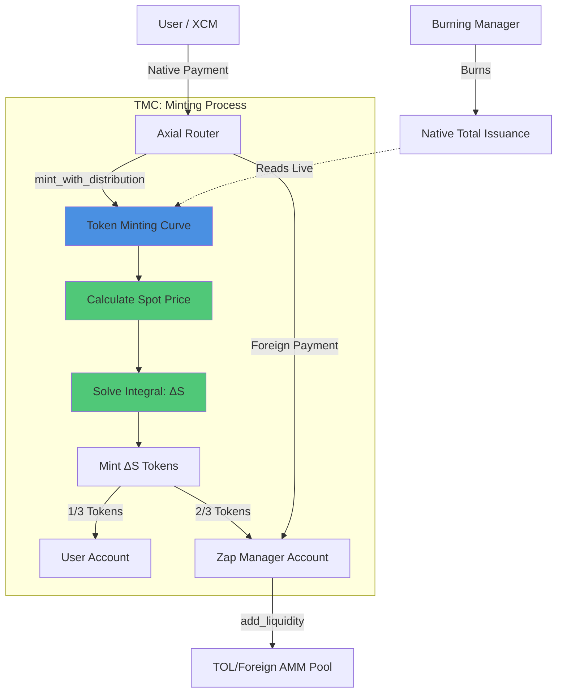

# Token Minting Curve: Dynamic Supply Issuance Architecture

> **On-Chain Account** (PalletId: `tmcurve0`)
> - SS58: `5EYCAe5jXfhqLzusixrt2Ch3ZateFvpRuiGFejB9K4oodMC1`
> - Hex: `0x6d6f646c746d6375727665300000000000000000000000000000000000000000`

## Executive Summary

The Token Minting Curve (TMC) is a `Unidirectional Minting Engine` that issues native tokens via a deterministic linear price ceiling. It implements a mathematical "ratchet" that allows token creation but never reverse extraction, ensuring that every minted token is mathematically justified by the integral of the bonding curve.

## Architecture Overview

### Design Philosophy

1. `Unidirectional Minting`: Mathematical "Ratchet" — tokens can be created but never extracted from the curve reserve.
2. `Deterministic Pricing`: Every token has a price determined by the linear curve P(s) = P₀ + slope × s.
3. `Integral-Based Fairness`: Exact cost calculation via continuous integration ensures no user pays more than the mathematical optimum.
4. `Overflow Safety`: U256 intermediate arithmetic prevents precision loss in high-value calculations.
5. `Governance Control`: Curve parameters are adjustable post-launch through governance.

### System Architecture



## Core Logic: The Minting Process

### Step-by-Step Execution

`1. Curve Lookup`

- `get_curve(asset_kind)` retrieves the stored `CurveConfig`
- Contains: `initial_price`, `slope_parameter`, `initial_issuance`, `native_asset_id`, `foreign_asset_id`

`2. Effective Supply Calculation`

- `effective_supply = total_issuance - initial_issuance`
- Uses live `Currency::total_issuance()` — burns instantly compress the curve

`3. Spot Price Calculation`

- `P(s) = initial_price + (slope × effective_supply) / precision`
- Linear ceiling moves up as more tokens are minted

`4. Integral-Based Token Calculation`

- User provides `cost` (in native tokens)
- Solve quadratic formula: `ΔS = (√((K×P)² + 2×m×K²×Cost) - K×P) / m`
- Where: `K = precision`, `m = slope`, `P = current_price`, `Cost = user_payment`
- Uses U256 internally to prevent intermediate overflow

`5. Distribution Split`

- Mint total `ΔS` tokens
- Transfer 1/3 to user (`UserAllocationRatio` = 1/3)
- Transfer 2/3 to Zap Manager account
- Emit `ZapAllocationDistributed` event

`6. Post-Mint Integration`

- Foreign payment is transferred to `ZapManagerAccount`
- 2/3 minted native share is minted to `ZapManagerAccount`
- Zap Manager hook cycle processes balances, adds liquidity, and transfers LP to a token-resolved TOL ingress account
- Router/BurningManager handle fee capture and burn flow on swap paths

## Mathematical Foundation

### Linear Price Ceiling

```
P(s) = P₀ + slope × s

Where:
  P₀    = initial_price (genesis parameter)
  slope = slope_parameter (adjustable via governance)
  s     = effective_supply = total_issuance - initial_issuance
```

### Integral-Based Minting Formula

The cost of minting `ΔS` tokens is the area under the curve:

```
Cost = ∫[s, s+ΔS] P(x) dx
     = P₀×ΔS + (slope/2) × ((s+ΔS)² - s²)

Solving for ΔS given Cost:
  ΔS = (√((K×P)² + 2×m×K²×Cost) - K×P) / m

Where:
  K = precision (scaling factor, e.g. 10¹²)
  m = slope
  P = P(s) = current spot price
```

This ensures users pay the exact mathematical cost for their token allocation.

### Overflow Protection

All intermediate calculations use `U256` (256-bit unsigned integers):

- `slope × effective_supply` → U256
- `(K×P)² + 2×m×K²×Cost` → U256
- `sqrt(...)` → U256
- Final division back to `Balance` (u128)

## Core Components

### 1. Curve Configuration Storage

```rust
#[derive(Encode, Decode, TypeInfo, MaxEncodedLen, Clone, Debug, PartialEq)]
pub struct CurveConfig<Balance, AssetId> {
    pub initial_price: Balance,
    pub slope_parameter: Balance,
    pub initial_issuance: Balance,
    pub native_asset_id: AssetId,
    pub foreign_asset_id: AssetId,
}

#[pallet::storage]
pub type TokenCurves<T: Config> = StorageMap<
    _,
    Blake2_128Concat,
    AssetKind,
    CurveConfig<BalanceOf<T>, AssetIdOf<T>>,
>;
```

Each `AssetKind` (e.g., `Native`, `Foreign(1)`) can have its own bonding curve. The `native_asset_id` and `foreign_asset_id` specify which assets participate in the minting pair.

### 2. Minting Availability (Current Runtime)

Current implementation does not maintain a dedicated `MintingPaused` storage flag. Minting availability is governed by curve existence, parameter validity, and normal origin/economic checks.

### 3. Configuration Parameters

| Parameter             | Type      | Description                                                                 |
| :-------------------- | :-------- | :-------------------------------------------------------------------------- |
| `InitialPrice`        | Balance   | Base price P₀ at curve genesis                                              |
| `SlopeParameter`      | Balance   | Linear curve slope (price increment per token)                              |
| `Precision`           | Balance   | Scaling factor for fixed-point arithmetic (e.g., 10¹²)                      |
| `UserAllocationRatio` | Permill   | Fraction to user (default: 1/3 = 333_333 Permill)                           |
| `PalletId`            | PalletId  | Derives the TMC pallet account for pallet-owned operations                  |
| `TreasuryAccount`     | AccountId | Compatibility/config hook; currently mapped to the TOL pallet account       |
| `ZapManagerAccount`   | AccountId | Active recipient of mint-side protocol allocation (2/3 minted native share) |

### 4. Extrinsics (Governance-Controlled)

`Create Curve`:

```rust
#[pallet::call_index(0)]
#[pallet::weight(T::WeightInfo::create_curve())]
pub fn create_curve(
    origin: OriginFor<T>,
    asset_kind: AssetKind,
    initial_price: BalanceOf<T>,
    slope_parameter: BalanceOf<T>,
) -> DispatchResult
```

Initializes a new bonding curve. Stores `initial_issuance = Currency::total_issuance()` as the baseline.

`Update Curve`:

```rust
#[pallet::call_index(1)]
#[pallet::weight(T::WeightInfo::update_curve())]
pub fn update_curve(
    origin: OriginFor<T>,
    asset_kind: AssetKind,
    new_slope: BalanceOf<T>,
) -> DispatchResult
```

Adjusts the slope parameter post-launch. Does NOT change `initial_price` or `initial_issuance`.

`Current call surface`:

- `create_curve` (`call_index(0)`)
- `update_curve` (`call_index(1)`)

Mint execution is performed through the internal mint flow invoked by Router/TMC integration path.

## Ecosystem Integration

### Connection to Axial Router (Primary Minting Gateway)

The Router orchestrates minting by:

1. Receiving user intent and routing to TMC mint path when economically preferred
2. Calling TMC minting flow (`mint_with_distribution`)
3. Preserving normal router fee semantics on swap routes, while mint-side distribution is handled by TMC/ZapManager accounts
4. User receiving 1/3 of minted native allocation directly

Fee architecture note: transaction fee capture and burn semantics are enforced by Axial Router + Burning Manager, not by TMC treasury logic.

### Connection to Zap Manager (Liquidity Provisioning)

TMC distributes mint-side protocol allocation to `ZapManagerAccount`. Zap Manager then:

- Accumulates native tokens from TMC
- Receives foreign tokens from mint flow
- Calls `add_liquidity` on Native/Foreign AMM pools
- Transfers minted LP to token-resolved TOL ingress accounts for protocol liquidity accounting
- Maintains liquidity depth for both directions (mint and secondary-market operations)

### Connection to Burning Manager (Bidirectional Compression)

BM doesn't call TMC directly, but their interaction is critical:

- BM burns native tokens → `Currency::total_issuance()` decreases
- TMC reads `effective_supply = total_issuance - initial_issuance`
- Lower supply → lower spot price → ceiling compresses
- This creates `bidirectional pressure`: BM lowers ceiling, TOL raises floor

### Connection to TOL (Price Floor)

While TMC provides the ceiling, TOL provides the floor:

- TOL buys at oracle-backed minimum price
- TMC sells at curve-determined maximum price
- The spread between them is the `minting profit margin`
- As BM burns tokens, the ceiling compresses toward the floor

## Events

| Event | Emitted When | Purpose |
| :---- | :----------- | :------ |
| `CurveCreated { token_asset, initial_price, slope, foreign_asset }` | New curve initialized | Track curve genesis and collateral binding |
| `CurveUpdated { token_asset, new_slope }` | Slope parameter changed | Track governance adjustments |
| `ZapAllocationDistributed { token_asset, user_allocation, zap_allocation, foreign_amount }` | Tokens split after mint | Track distribution ratio and collateral inflow |

## Error Conditions

| Error                 | Condition                                | Resolution                                  |
| :-------------------- | :--------------------------------------- | :------------------------------------------ |
| `CurveAlreadyExists`  | `create_curve` called for existing curve | Use `update_curve` instead                  |
| `NoCurveExists`       | Minting attempted without curve          | Governance must call `create_curve`         |
| `InsufficientBalance` | User payment < calculated cost           | Increase payment amount                     |
| `ZeroAmount`          | Mint requested with zero cost            | Provide non-zero payment                    |
| `ArithmeticOverflow`  | U256 calculation exceeded bounds         | Should be impossible with proper parameters |
| `InvalidParameters`   | Slope or price = 0 at curve creation     | Use non-zero parameters                     |
| `ExceedsMaxSupply`    | Mint would exceed Balance::MAX           | Theoretical limit, unlikely in practice     |

## Implementation Status

- `Mechanism`: Extrinsic-driven (user initiates via Router).
- `Math Engine`: Integral-based quadratic solver with U256 overflow protection.
- `Distribution`: 1/3 user, 2/3 Zap Manager (configurable via `UserAllocationRatio`).
- `Governance`: Admin-controlled curve parameters.
- `Compression`: Bidirectional with BM (burns reduce ceiling dynamically).
- `Domain Glue`: `create_curve` executes runtime hook that bootstraps TOL domain routing and enables Zap processing for the token.

### Planned Evolution (Post-Release)

- Extend lifecycle glue beyond curve creation into broader token lifecycle checkpoints.
- Expand per-domain policy surfaces for richer TMC/Zap/TOL coordination templates.
- Canonical `$BLDR` target profile: approximately `1/3` buyer, `1/3` liquidity path, `1/3` treasury.
- For `$BLDR`, planned L2 Bucket `B` buyer context burns the buyer tranche immediately (route-agnostic: TMC or XYK), reducing effective supply ceiling.
