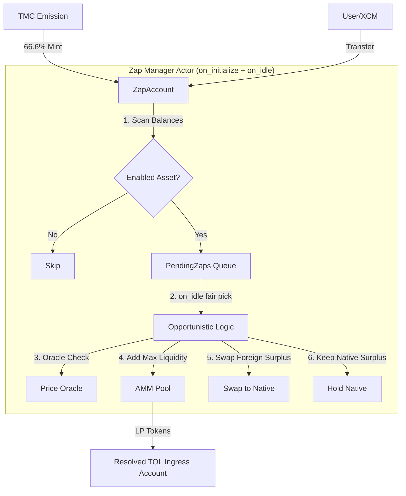

# Zap Manager: Opportunistic Liquidity Provisioning Architecture

> **On-Chain Account** (PalletId: `zapmgr00`)
> - SS58: `5EYCAe5kira59NCr1jxZe4LuY5z1uzgTtoJp7fPwXZMtC5Hn`
> - Hex: `0x6d6f646c7a61706d677230300000000000000000000000000000000000000000`

## Executive Summary

The Zap Manager is a `Reactive Economic Actor` that transforms raw capital (Native/Foreign tokens) into Protocol-Owned Liquidity (LP Tokens). Unlike traditional "Zappers" that aggressively swap assets to achieve a 50/50 split, this actor implements an `Opportunistic Strategy` designed to maximize Native token accumulation and minimize unnecessary slippage.

It operates as an `Omnivorous` system: it does not rely on specific "deposit" extrinsics but instead reacts to the presence of tokens on its balance, regardless of their source (TMC emission, XCM transfer, or manual deposit).

## Architecture Overview

### Design Philosophy

1.  `Token-Driven Coordination`: Balance detection runs in `on_initialize`, execution runs in `on_idle`, and no user extrinsic is required for normal zap flow.
2.  `Omnivorous Intake`: Accepts any whitelisted asset arriving at its account ("Wrong Door" deposits become liquidity).
3.  `Opportunistic Provisioning`: Prioritizes adding liquidity _as-is_ over swapping.
4.  `Patriotic Accumulation`: Surplus Native tokens are preserved; surplus Foreign tokens are converted to Native.
5.  `Oracle-Gated Security`: All operations are gated by Price Oracle validation to prevent manipulation.

### System Architecture



## Core Logic: The Opportunistic Zap

The Zap Manager executes a strict two-phase loop: `on_initialize` snapshots/enqueues eligible assets, then `on_idle` processes pending zaps under the remaining weight budget.

### The Decision Tree

1.  `Snapshot`: Read balances of `Native` and `Foreign` (Asset X) on the Zap Manager account.
2.  `Oracle Guard`: Verify that the spot price of the `Native/Foreign` pool does not deviate from the EMA Oracle. If it does, `abort` to prevent sandwich attacks.
3.  `Step 1: Opportunistic Add (Add As-Is)`
    - Calculate the maximum amount of liquidity that can be added with the _current_ balance ratio.
    - _Example_: If holding 100 Native and 20 Foreign, and pool price is 1:1, add 20 Native + 20 Foreign.
    - Execute `add_liquidity`.
4.  `Error Handling & Backpressure`:
    - If any step fails (e.g., Price Oracle deviation, Slippage, or Pool errors), the operation aborts.
    - A `Retry Cooldown` (default 10 blocks) is activated for the specific asset.
    - The asset is skipped in subsequent blocks until the cooldown expires, preventing resource exhaustion during volatile market conditions.
5.  `Step 2: Foreign Surplus Management`
    - Check remaining balance.
    - `If Foreign > Dust`: The actor is "overweight" on Foreign assets.
    - `Action`: Swap remaining Foreign -> Native.
    - _Rationale_: Foreign assets sitting idle are unproductive. Converting them to Native builds the protocol's sovereign reserve for future pairing.
6.  `Step 3: Native Surplus Management`
    - Check remaining balance.
    - `If Native > Dust`: The actor is "overweight" on Native assets.
    - `Action`: `HOLD`. Do not swap.
    - _Rationale_: Native token is the system's collateral. Swapping it for Foreign creates sell pressure. Holding it prepares the actor to capture the next influx of Foreign tokens (e.g., from fees or XCM).

## Core Components

### 1. Strict Whitelist (`EnabledAssets`)

To prevent the `on_initialize` hook from becoming a denial-of-service vector (by flooding the account with thousands of dust tokens), the Zap Manager only processes assets explicitly enabled by Governance.

```rust
/// Assets enabled for automatic zapping
#[pallet::storage]
pub type EnabledAssets<T: Config> = StorageMap<_, Blake2_128Concat, AssetKind, (), OptionQuery>;
```

### 2. Two-Phase Intake and Execution

The pallet keeps `Assets` balances as the source of truth, but execution is explicitly staged:

- `on_initialize`: scans `EnabledAssets`, applies cooldown checks, and writes eligible foreign balances into `PendingZaps`
- `on_idle`: drains pending entries and executes zaps while weight budget is available
- Deferred entries are reinserted, and `ZapExecutionCursor` keeps deterministic round-robin ordering across assets

### 3. Retry Cooldown (Backpressure)

To ensure system stability during market turbulence or attack scenarios, the Zap Manager implements a mandatory cooldown mechanism.

- `Trigger`: Any failed `execute_opportunistic_zap` attempt (e.g., due to Oracle deviation).
- `Effect`: The asset is marked with `NextZapAttempt = CurrentBlock + Cooldown`.
- `Logic`: `on_initialize` skips processing for this asset until `CurrentBlock >= NextZapAttempt`.
- `Benefit`: Prevents the system from wasting block weight retry-looping during sustained volatility or attack vectors.

### 4. Price Oracle Integration

Safety checks are mandatory. The manager will refuse to trade if the market is volatile.

```rust
// In process_zap
let spot_price = Pool::spot_price(Native, Asset);
let oracle_price = Oracle::get_ema_price(Native, Asset);

ensure!(
    is_within_deviation(spot_price, oracle_price, MAX_DEVIATION),
    Error::<T>::PriceManipulationDetected
);
```

## Ecosystem Integration

### Connection to TMC (The Heart)

The Token Minting Curve (TMC) mints new Native tokens when demand pushes the price above the ceiling.

- `TMC Action`: Mints 100 tokens. 66.6 tokens are sent to `Zap Manager`.
- `Zap Reaction`: Zap Manager detects new Native balance. It holds them (Step 3) until arbitrageurs or XCM bring Foreign assets to pair with them, effectively "catching" the volatility.

### Connection to TOL (Liquidity Vault)

The LP tokens created by the Zap Manager are transferred to a runtime-resolved TOL ingress account based on token binding (`AssetId -> TolId`).

- `Result`: The protocol owns the liquidity positions under token-domain ingress routing.
- `Benefit`: TOL can route LP ingress by token domain and apply domain-scoped bucket/queue/buffer state.
- `LP sweep routing`: manual `sweep_trigger` resolves LP assets via LP pair metadata and token-domain binding, not only by direct token key.
- `Current wiring note`: Zap Manager pallet code transfers LP to resolved TOL ingress accounts but does not directly dispatch TOL `receive_lp_tokens`; that trigger is handled by integration/automation flow.

## Resilience & Load Testing

The Zap Manager has been hardened through comprehensive load testing simulating production stress conditions (see `template/runtime/src/tests/zap_manager_load_tests.rs`):

1.  `Batch Processing`: Validated ability to process accumulated deposits from hundreds of users in a single `on_initialize` batch (O(1) execution from the perspective of the hook trigger).
2.  `Omnivorous Intake`: Confirmed handling of multi-asset deposits from diverse sources (XCM, direct transfers, extrinsics) simultaneously.
3.  `Backpressure Verification`: Validated that the `RetryCooldown` mechanism effectively stops processing during the cooldown window, protecting the chain from wasted compute during oracle failures.
4.  `Patriotic Accumulation`: Confirmed that under load, Native tokens are held securely when Foreign tokens are unavailable, adhering to the manifesto's accumulation strategy.
5.  `Skewed Load Fairness`: Verified with one-cycle `on_idle` budget that heavy continuous flow on one asset does not starve a secondary pending asset under round-robin cursor scheduling.

## Implementation Status

### Current Architecture

- `Mechanism`: Reactive two-phase hooks (`on_initialize` intake + `on_idle` execution)
- `Scheduling`: Weight-bounded pending drain with deterministic round-robin cursor across pending assets
- `Strategy`: Opportunistic (Native Accumulation)
- `Security`: Oracle-Gated + Whitelist + Retry Cooldown

### Planned Evolution (Post-Release)

- Token-scoped TOL ingress routing and TOL domain state isolation are active
- TMC curve activation auto-enables Zap processing and bootstraps matching TOL domain glue for the token
- Next optimization target (only if constraints appear): stronger domain-level fairness guarantees under extreme skew, such as bounded per-domain quotas beyond the current round-robin baseline
- Remaining roadmap: richer per-domain Zap policy surfaces and deeper lifecycle orchestration
- Canonical `$BLDR` profile target keeps liquidity policy in Anchor-focused TOL behavior while treasury/emission logic is handled by token policy configuration
