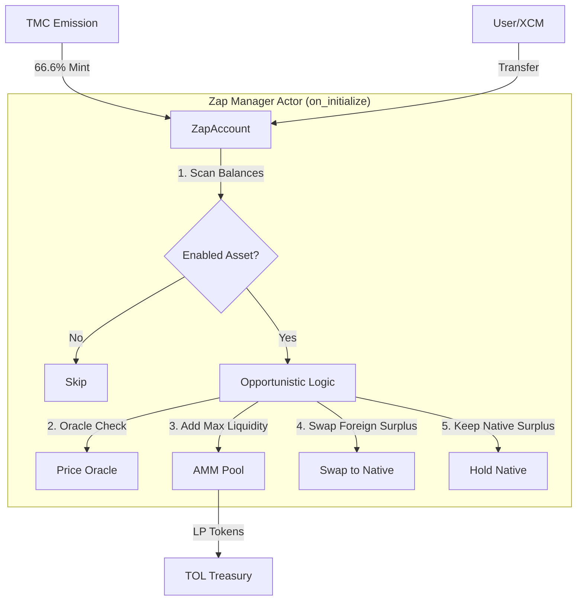

# Zap Manager: Opportunistic Liquidity Provisioning Architecture

## Executive Summary

The Zap Manager is a **Reactive Economic Actor** that transforms raw capital (Native/Foreign tokens) into Protocol-Owned Liquidity (LP Tokens). Unlike traditional "Zappers" that aggressively swap assets to achieve a 50/50 split, this actor implements an **Opportunistic Strategy** designed to maximize Native token accumulation and minimize unnecessary slippage.

It operates as an **Omnivorous** system: it does not rely on specific "deposit" extrinsics but instead reacts to the presence of tokens on its balance, regardless of their source (TMC emission, XCM transfer, or manual deposit).

## Architecture Overview

### Design Philosophy

1.  **Token-Driven Coordination**: Logic is triggered by the presence of balance (`on_initialize`), not by user extrinsics.
2.  **Omnivorous Intake**: Accepts any whitelisted asset arriving at its account ("Wrong Door" deposits become liquidity).
3.  **Opportunistic Provisioning**: Prioritizes adding liquidity _as-is_ over swapping.
4.  **Patriotic Accumulation**: Surplus Native tokens are preserved; surplus Foreign tokens are converted to Native.
5.  **Oracle-Gated Security**: All operations are gated by Price Oracle validation to prevent manipulation.

### System Architecture


```mermaid
graph TD
    TMC[TMC Emission] -->|66.6% Mint| ZapAccount
    User[User/XCM] -->|Transfer| ZapAccount

    subgraph "Zap Manager Actor (on_initialize)"
        ZapAccount -->|1. Scan Balances| Whitelist{Enabled Asset?}
        Whitelist -->|No| Skip
        Whitelist -->|Yes| Logic[Opportunistic Logic]

        Logic -->|2. Oracle Check| Oracle[Price Oracle]

        Logic -->|3. Add Max Liquidity| Pool[AMM Pool]
        Logic -->|4. Swap Foreign Surplus| Swap[Swap to Native]
        Logic -->|5. Keep Native Surplus| Hold[Hold Native]
    end

    Pool -->|LP Tokens| TOL[TOL Treasury]
```

## Core Logic: The Opportunistic Zap

The Zap Manager executes a strict decision tree during every block initialization for each `EnabledAsset`.

### The Decision Tree

1.  **Snapshot**: Read balances of `Native` and `Foreign` (Asset X) on the Zap Manager account.
2.  **Oracle Guard**: Verify that the spot price of the `Native/Foreign` pool does not deviate from the EMA Oracle. If it does, **abort** to prevent sandwich attacks.
3.  **Step 1: Opportunistic Add (Add As-Is)**
    - Calculate the maximum amount of liquidity that can be added with the _current_ balance ratio.
    - _Example_: If holding 100 Native and 20 Foreign, and pool price is 1:1, add 20 Native + 20 Foreign.
    - Execute `add_liquidity`.
4.  **Error Handling & Backpressure**:
    - If any step fails (e.g., Price Oracle deviation, Slippage, or Pool errors), the operation aborts.
    - A **Retry Cooldown** (default 10 blocks) is activated for the specific asset.
    - The asset is skipped in subsequent blocks until the cooldown expires, preventing resource exhaustion during volatile market conditions.
5.  **Step 2: Foreign Surplus Management**
    - Check remaining balance.
    - **If Foreign > Dust**: The actor is "overweight" on Foreign assets.
    - **Action**: Swap remaining Foreign -> Native.
    - _Rationale_: Foreign assets sitting idle are unproductive. Converting them to Native builds the protocol's sovereign reserve for future pairing.
6.  **Step 3: Native Surplus Management**
    - Check remaining balance.
    - **If Native > Dust**: The actor is "overweight" on Native assets.
    - **Action**: **HOLD**. Do not swap.
    - _Rationale_: Native token is the system's collateral. Swapping it for Foreign creates sell pressure. Holding it prepares the actor to capture the next influx of Foreign tokens (e.g., from fees or XCM).

## Core Components

### 1. Strict Whitelist (`EnabledAssets`)

To prevent the `on_initialize` hook from becoming a denial-of-service vector (by flooding the account with thousands of dust tokens), the Zap Manager only processes assets explicitly enabled by Governance.

```rust
/// Assets enabled for automatic zapping
#[pallet::storage]
pub type EnabledAssets<T: Config> = StorageMap<_, Blake2_128Concat, AssetKind, (), OptionQuery>;
```

### 2. Omnivorous Balance Scanner

The pallet does not store "Pending Allocations". Instead, it trusts the `Assets` pallet as the source of truth.

```rust
fn on_initialize() -> Weight {
    for asset in EnabledAssets::<T>::iter_keys() {
        let balance = Assets::balance(asset, &Self::account_id());
        if balance > T::MinThreshold::get() {
             Self::process_zap(asset, balance);
        }
    }
}
```

### 3. Retry Cooldown (Backpressure)

To ensure system stability during market turbulence or attack scenarios, the Zap Manager implements a mandatory cooldown mechanism.

- **Trigger**: Any failed `execute_opportunistic_zap` attempt (e.g., due to Oracle deviation).
- **Effect**: The asset is marked with `NextZapAttempt = CurrentBlock + Cooldown`.
- **Logic**: `on_initialize` skips processing for this asset until `CurrentBlock >= NextZapAttempt`.
- **Benefit**: Prevents the system from wasting block weight retry-looping during sustained volatility or attack vectors.

### 4. Price Oracle Integration

Safety checks are mandatory. The manager will refuse to trade if the market is volatile.

```rust
// In process_zap
let spot_price = Pool::spot_price(Native, Asset);
let oracle_price = Oracle::get_ema_price(Native, Asset);

ensure!(
    is_within_deviation(spot_price, oracle_price, MAX_DEVIATION),
    Error::<T>::PriceManipulationDetected
);
```

## Ecosystem Integration

### Connection to TMC (The Heart)

The Token Minting Curve (TMC) mints new Native tokens when demand pushes the price above the ceiling.

- **TMC Action**: Mints 100 tokens. 66.6 tokens are sent to `Zap Manager`.
- **Zap Reaction**: Zap Manager detects new Native balance. It holds them (Step 3) until arbitrageurs or XCM bring Foreign assets to pair with them, effectively "catching" the volatility.

### Connection to TOL (The Treasury)

The LP tokens created by the Zap Manager are immediately transferred to the **TOL Treasury** account.

- **Result**: The protocol owns the liquidity.
- **Benefit**: As trading volume grows, the fees accrue to the TOL, creating a self-reinforcing liquidity deepening cycle.

## Resilience & Load Testing

The Zap Manager has been hardened through comprehensive load testing simulating production stress conditions (see `template/runtime/src/tests/zap_manager_load_tests.rs`):

1.  **Batch Processing**: Validated ability to process accumulated deposits from hundreds of users in a single `on_initialize` batch (O(1) execution from the perspective of the hook trigger).
2.  **Omnivorous Intake**: Confirmed handling of multi-asset deposits from diverse sources (XCM, direct transfers, extrinsics) simultaneously.
3.  **Backpressure Verification**: Validated that the `RetryCooldown` mechanism effectively stops processing during the cooldown window, protecting the chain from wasted compute during oracle failures.
4.  **Patriotic Accumulation**: Confirmed that under load, Native tokens are held securely when Foreign tokens are unavailable, adhering to the manifesto's accumulation strategy.

## Implementation Status

### Current Architecture

- **Mechanism**: Reactive / On-Initialize (Poll-based).
- **Strategy**: Opportunistic (Native Accumulation).
- **Security**: Oracle-Gated + Whitelist + Retry Cooldown.
